# AEGIS-FI
## The Trust Infrastructure Layer for Autonomous Finance
### Enterprise System Design & Architecture Document

**Document Type:** Technical Design Document (TDD) + Product Requirements Document (PRD) + Architecture Decision Record (ADR)
**Audience:** Investors, Hackathon Judges, Engineering Teams, Founders
**Version:** 1.0
**Classification:** Confidential — Strategic Product Design

---

## Table of Contents

1. Product Vision
2. Problem Statement
3. Business Architecture
4. Capability Map
5. User Journeys
6. Use Cases
7. Functional & Non-Functional Requirements
8. High-Level Design (HLD)
9. Low-Level Design (LLD) — Per Module
10. Component Architecture
11. Microservices Architecture
12. Multi-Agent Architecture
13. Data Flow Diagrams
14. Sequence Diagrams
15. Entity Relationship Diagrams
16. Knowledge Graph Design
17. RAG Architecture
18. Memory Cortex Architecture
19. Digital Twin Architecture
20. Event-Driven Architecture
21. Security Architecture
22. Trust Ledger Architecture
23. Deployment & Infrastructure Architecture
24. API Design
25. Database Schema Design
26. Agent Interaction Flow
27. CI/CD Pipeline
28. Monitoring & Observability Architecture
29. Technology Stack — Deep Dive & Justification
30. Hackathon MVP vs Enterprise Scale Design
31. Phased Implementation Roadmap (MVP → V1 → V2 → V3)
32. SDLC, Team Structure & Risk Analysis
33. Testing Strategy
34. Production Readiness Checklist
35. Cost Estimation
36. Future Evolution — AI-Native Banking

---

# 1. Product Vision

> **AEGIS-FI is the trust operating system for the next generation of finance** — a layer that sits beneath every human decision, every AI agent decision, and every agent-to-agent transaction, continuously answering five questions: **What is happening? Why is it happening? What will happen next? What should we do? How do we improve?**

As financial institutions move from human-only decisioning to hybrid human+AI and eventually autonomous agent-to-agent transacting (agentic lending, agentic trading, agentic procurement), the existing model of siloed Fraud, AML, Cyber, Compliance, and Risk systems breaks down. Each system sees a slice of truth. None of them share memory. None of them simulate consequences before acting. None of them audit AI agents the way they audit humans.

AEGIS-FI's vision is to become the **unified nervous system, immune system, memory, and conscience** of autonomous finance — a single trust fabric that every transaction, human or machine-originated, passes through.

**North Star Metric:** % of financial-grade decisions (human or agentic) that are detected, explained, simulated, and audited through a single trust layer with sub-second latency and full explainability.

---

# 2. Problem Statement

## 2.1 Current State

Financial institutions operate fragmented, siloed trust systems:

| System | Question it Answers | Owner | Data It Sees |
|---|---|---|---|
| Fraud System | Is this transaction fraudulent? | Fraud Ops | Transaction-level |
| AML System | Is this money laundering? | Compliance | Account-level patterns |
| Cybersecurity System | Is this an intrusion? | InfoSec | Network/device-level |
| Compliance System | Does this violate regulation? | Legal/Compliance | Policy rules |
| Risk System | What is our exposure? | Risk | Portfolio-level |

These systems **do not share a knowledge graph, do not share institutional memory, do not simulate outcomes, and have no concept of auditing an AI agent's decision** the way they would audit a human underwriter.

## 2.2 Emerging State (Why This Is Urgent)

Banks are introducing:
- **AI co-pilots** for underwriting, credit decisions, and customer service
- **Autonomous trading agents** executing without per-trade human sign-off
- **Agent-to-agent commerce** (procurement bots negotiating with vendor bots)
- **Autonomous lending agents** approving microloans algorithmically

None of the legacy five systems above were built to answer: *"Which AI agent made this decision, on what data, with what historical accuracy, and was it explainable and auditable?"*

## 2.3 Core Problem Statement

> **There is no unified trust layer that can detect, explain, simulate, decide, act, and learn across human decisions, AI decisions, and agent-to-agent transactions in real time — leaving financial institutions structurally blind to a category of risk that is growing exponentially as AI autonomy increases.**

## 2.4 Why Existing Vendors Don't Solve This

- Point-solution fraud vendors (Sift, Feedzai, Forter) detect but don't simulate or govern AI agents.
- GRC platforms (MetricStream, ServiceNow GRC) manage policy but have no real-time detection or memory.
- Observability tools (Datadog, Arize) monitor model drift but have no financial domain knowledge graph or digital twin.
- **AEGIS-FI is the first to combine detection + institutional memory + simulation + governance of AI agents + immutable trust ledger in one platform.**

---

# 3. Business Architecture

## 3.1 Business Capability Layers

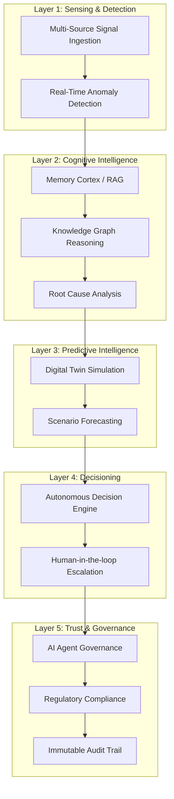
```mermaid
graph TB
    subgraph "Layer 5: Trust & Governance"
        A1[AI Agent Governance]
        A2[Regulatory Compliance]
        A3[Immutable Audit Trail]
    end
    subgraph "Layer 4: Decisioning"
        B1[Autonomous Decision Engine]
        B2[Human-in-the-loop Escalation]
    end
    subgraph "Layer 3: Predictive Intelligence"
        C1[Digital Twin Simulation]
        C2[Scenario Forecasting]
    end
    subgraph "Layer 2: Cognitive Intelligence"
        D1[Memory Cortex / RAG]
        D2[Knowledge Graph Reasoning]
        D3[Root Cause Analysis]
    end
    subgraph "Layer 1: Sensing & Detection"
        E1[Multi-Source Signal Ingestion]
        E2[Real-Time Anomaly Detection]
    end

    E1 --> E2 --> D1
    D1 --> D2 --> D3
    D3 --> C1 --> C2
    C2 --> B1 --> B2
    B2 --> A1 --> A2 --> A3
```

## 3.2 Value Chain Mapping

| Business Function | AEGIS-FI Pillar | Value Delivered |
|---|---|---|
| Loss Prevention | Detect + Act | Reduced fraud/AML losses |
| Regulatory Defense | Compliance + Governance | Reduced fines, faster audits |
| Customer Trust | Simulate + Act (optimal friction) | Lower false-positive churn |
| AI Risk Management | Governance Agent | Auditable, explainable AI decisions |
| Operational Efficiency | Memory Cortex | Faster analyst investigation (84 similar cases in seconds) |

## 3.3 Stakeholder Map

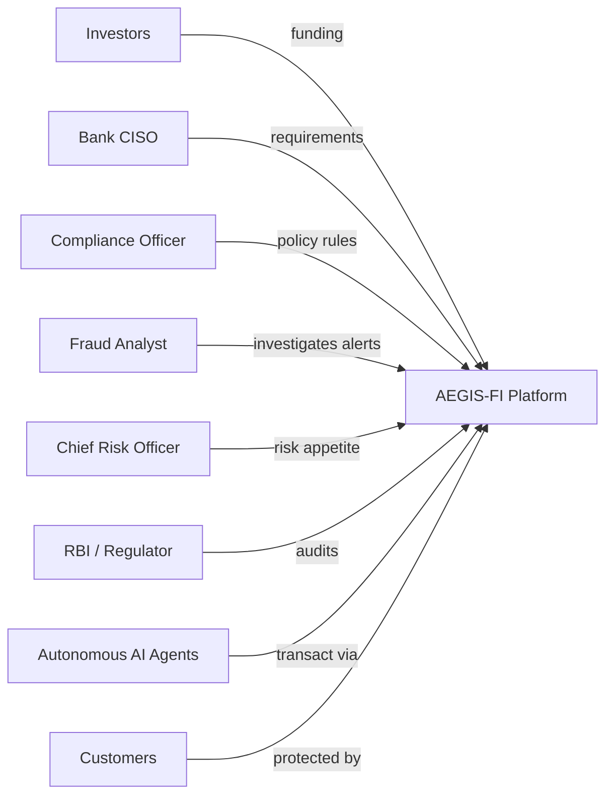
```mermaid
graph LR
    Investors -->|funding| AEGISFI[AEGIS-FI Platform]
    BankCISO[Bank CISO] -->|requirements| AEGISFI
    ComplianceOfficer[Compliance Officer] -->|policy rules| AEGISFI
    FraudAnalyst[Fraud Analyst] -->|investigates alerts| AEGISFI
    RiskOfficer[Chief Risk Officer] -->|risk appetite| AEGISFI
    Regulator[RBI / Regulator] -->|audits| AEGISFI
    AIAgents[Autonomous AI Agents] -->|transact via| AEGISFI
    Customers -->|protected by| AEGISFI
```

## 3.4 Revenue Model (Business Architecture Context)

1. **SaaS Platform Licensing** — per-institution annual subscription tiered by transaction volume.
2. **Usage-Based Pricing** — per 1,000 events processed / per agent governed.
3. **Professional Services** — integration, custom model tuning, regulatory mapping.
4. **Marketplace** — third-party detection models, compliance rule packs (future).


---

# 4. Capability Map

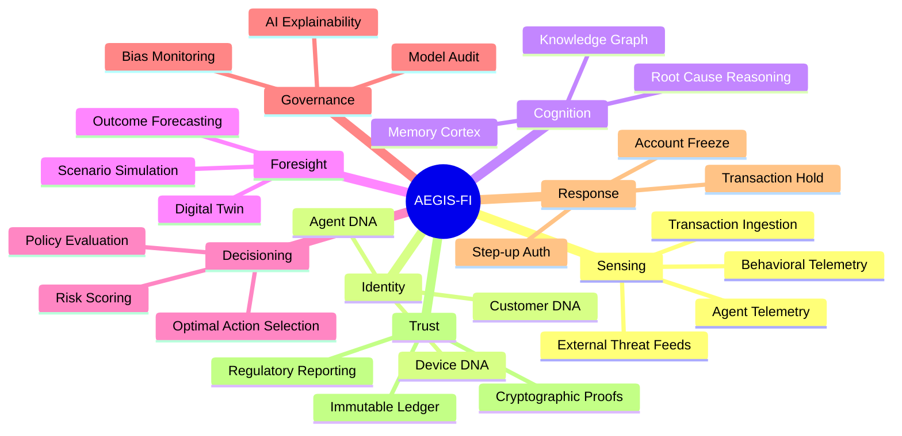
```mermaid
mindmap
  root((AEGIS-FI))
    Sensing
      Transaction Ingestion
      Behavioral Telemetry
      Agent Telemetry
      External Threat Feeds
    Identity
      Customer DNA
      Device DNA
      Agent DNA
    Cognition
      Knowledge Graph
      Memory Cortex
      Root Cause Reasoning
    Foresight
      Digital Twin
      Scenario Simulation
      Outcome Forecasting
    Decisioning
      Risk Scoring
      Policy Evaluation
      Optimal Action Selection
    Governance
      AI Explainability
      Model Audit
      Bias Monitoring
    Response
      Step-up Auth
      Transaction Hold
      Account Freeze
    Trust
      Immutable Ledger
      Cryptographic Proofs
      Regulatory Reporting
```

## 4.1 Capability Maturity Levels

| Capability | MVP | V1 | V2 | V3 (AI-Native) |
|---|---|---|---|---|
| Detection | Rule + 1 ML model | Multi-model ensemble | Real-time GNN | Self-tuning models |
| Memory | Static vector search | Hybrid RAG | Auto-summarized case memory | Continuous-learning memory |
| Simulation | Single scenario | Multi-scenario | Monte Carlo digital twin | Live what-if for every txn |
| Governance | Manual logging | Agent scorecards | Automated bias audits | Full AI-to-AI governance |
| Trust Ledger | DB table w/ hash | Append-only ledger | Blockchain-anchored | Post-quantum signed |

---

# 5. User Journeys

## 5.1 Journey: Fraud Analyst Investigates a Flagged Transaction

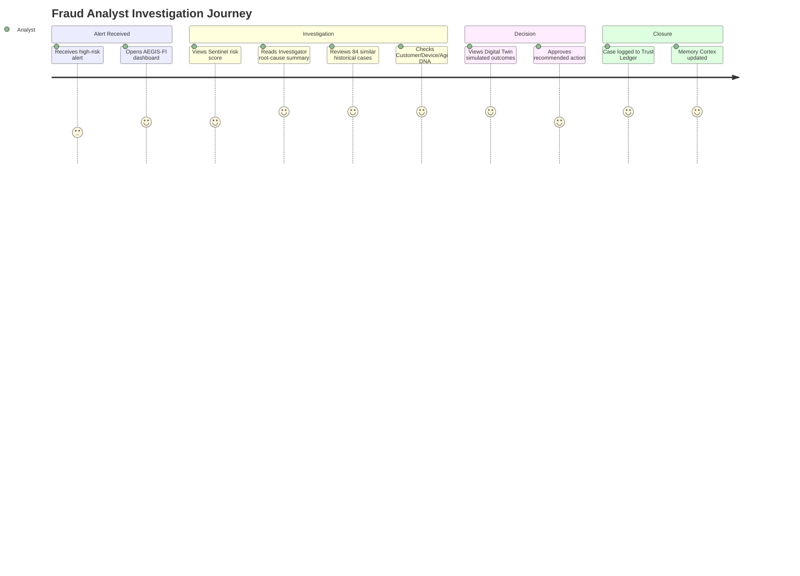
```mermaid
journey
    title Fraud Analyst Investigation Journey
    section Alert Received
      Receives high-risk alert: 3: Analyst
      Opens AEGIS-FI dashboard: 4: Analyst
    section Investigation
      Views Sentinel risk score: 4: Analyst
      Reads Investigator root-cause summary: 5: Analyst
      Reviews 84 similar historical cases: 5: Analyst
      Checks Customer/Device/Agent DNA: 5: Analyst
    section Decision
      Views Digital Twin simulated outcomes: 5: Analyst
      Approves recommended action: 4: Analyst
    section Closure
      Case logged to Trust Ledger: 5: Analyst
      Memory Cortex updated: 5: Analyst
```

## 5.2 Journey: Autonomous Lending Agent Requests Approval

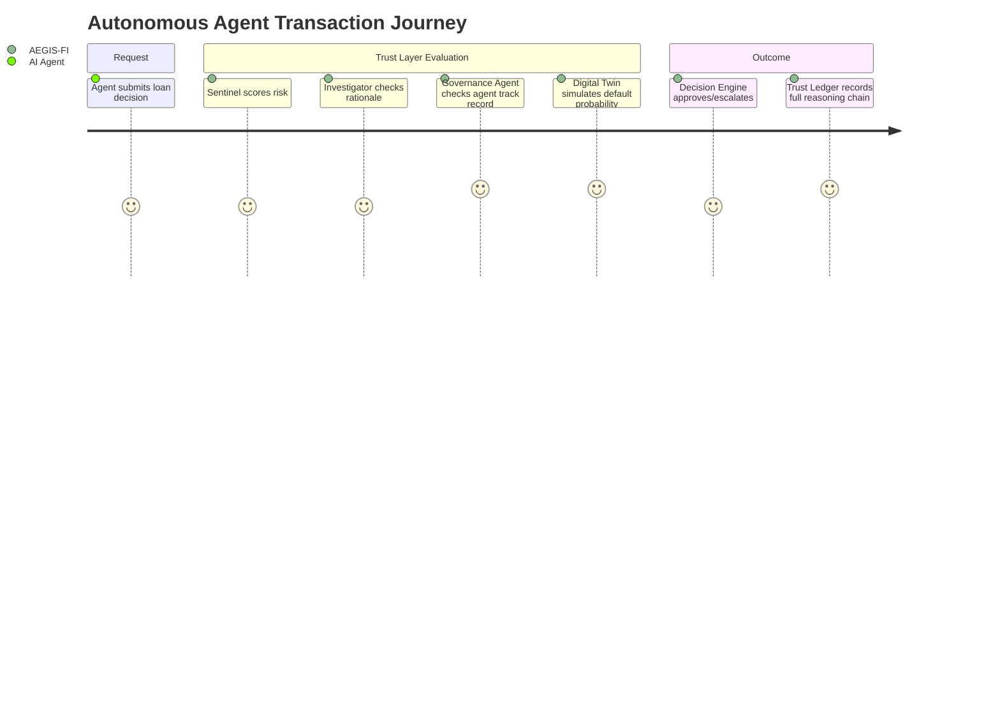
```mermaid
journey
    title Autonomous Agent Transaction Journey
    section Request
      Agent submits loan decision: 4: AI Agent
    section Trust Layer Evaluation
      Sentinel scores risk: 4: AEGIS-FI
      Investigator checks rationale: 4: AEGIS-FI
      Governance Agent checks agent track record: 5: AEGIS-FI
      Digital Twin simulates default probability: 5: AEGIS-FI
    section Outcome
      Decision Engine approves/escalates: 4: AEGIS-FI
      Trust Ledger records full reasoning chain: 5: AEGIS-FI
```

## 5.3 Journey: Compliance Officer Generates Regulatory Report

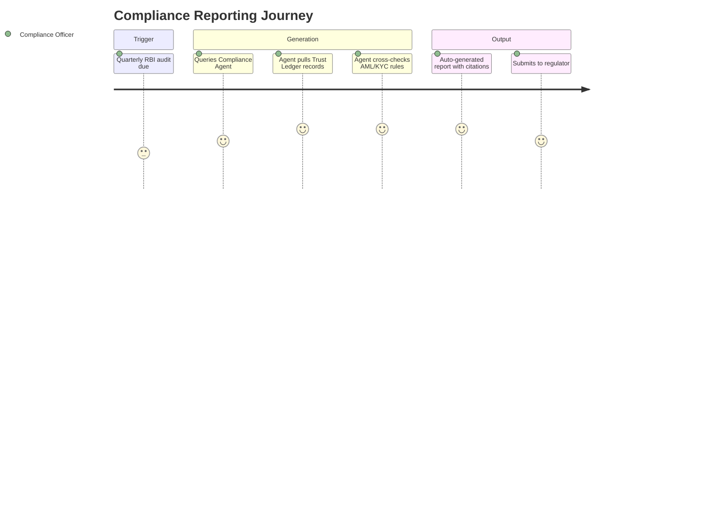
```mermaid
journey
    title Compliance Reporting Journey
    section Trigger
      Quarterly RBI audit due: 3: Compliance Officer
    section Generation
      Queries Compliance Agent: 4: Compliance Officer
      Agent pulls Trust Ledger records: 5: Compliance Officer
      Agent cross-checks AML/KYC rules: 5: Compliance Officer
    section Output
      Auto-generated report with citations: 5: Compliance Officer
      Submits to regulator: 4: Compliance Officer
```

---

# 6. Use Cases

| ID | Use Case | Primary Actor | Trigger | Outcome |
|---|---|---|---|---|
| UC-01 | Real-time transaction fraud scoring | Sentinel Agent | New transaction event | Risk score + category |
| UC-02 | Account takeover detection | Sentinel + Investigator | Anomalous login pattern | Freeze recommendation |
| UC-03 | Fraud ring discovery | Threat Knowledge Graph | Batch graph analysis | Linked entity cluster flagged |
| UC-04 | Historical case retrieval | Memory Cortex | Analyst query / new event | Top-N similar cases with outcomes |
| UC-05 | Pre-action simulation | Digital Twin | Decision Engine request | Predicted loss/churn per scenario |
| UC-06 | Optimal action selection | Decision Engine | Simulation results ready | Recommended action |
| UC-07 | AML/KYC compliance check | Compliance Agent | Transaction/customer onboarding | Pass/Fail + explanation |
| UC-08 | AI agent decision audit | Governance Agent | Agent emits a decision | Auditable record + trust score update |
| UC-09 | Step-up authentication trigger | Response Agent | Medium-risk score | OTP/MFA challenge issued |
| UC-10 | Account freeze execution | Response Agent | High-risk score | Account frozen, customer notified |
| UC-11 | Regulatory report generation | Compliance Agent | Scheduled / on-demand | PDF/structured report |
| UC-12 | Immutable decision recording | Trust Ledger | Any agent decision | Hash-chained ledger entry |
| UC-13 | Agent trust score evaluation | Governance Agent | Periodic / on-demand | Updated Agent DNA trust score |
| UC-14 | Human override of AI decision | Decision Engine | Analyst override action | Logged override + retraining signal |

### 6.1 Detailed Use Case — UC-02: Account Takeover Detection

- **Preconditions:** Customer DNA and Device DNA profiles exist.
- **Main Flow:**
  1. Login event ingested by Immune Sensing Layer.
  2. Sentinel Agent computes anomaly score using Isolation Forest + sequence model.
  3. If score > threshold, Investigator Agent queries Knowledge Graph for device/IP history.
  4. Memory Cortex retrieves similar account-takeover cases.
  5. Digital Twin simulates "freeze" vs "step-up auth" vs "allow" outcomes.
  6. Decision Engine selects optimal action; Response Agent executes.
  7. Trust Ledger logs full chain.
- **Postconditions:** Customer DNA risk history updated; case stored in Memory Cortex.


---

# 7. Functional & Non-Functional Requirements

## 7.1 Functional Requirements

| ID | Requirement |
|---|---|
| FR-01 | System shall ingest transaction, behavioral, agent, and external signal data in real time via streaming pipeline. |
| FR-02 | System shall maintain a live, continuously updated DNA profile for every Customer, Device, and AI Agent. |
| FR-03 | System shall store entity relationships in a graph database and support multi-hop relationship queries. |
| FR-04 | System shall retrieve semantically similar historical cases (vector search) within 200ms. |
| FR-05 | System shall produce a risk score (0-100) and category for every scored event. |
| FR-06 | System shall generate a human-readable root-cause explanation for every flagged event. |
| FR-07 | System shall simulate at least 3 candidate actions and predict financial/customer-experience impact before acting. |
| FR-08 | System shall select and recommend an optimal action based on simulation + compliance + memory. |
| FR-09 | System shall evaluate every transaction/customer against AML/KYC/RBI rule sets. |
| FR-10 | System shall track every AI agent's decision history, accuracy, failure rate, and bias score. |
| FR-11 | System shall execute response actions (OTP, hold, freeze, block) via integration APIs. |
| FR-12 | System shall write an immutable, cryptographically chained record for every decision. |
| FR-13 | System shall allow human analysts to override any automated decision, with override logged. |
| FR-14 | System shall expose REST/GraphQL APIs and a real-time event stream for all modules. |
| FR-15 | System shall support multi-tenant isolation for multiple bank clients. |

## 7.2 Non-Functional Requirements

| Category | Requirement | Target (Hackathon MVP) | Target (Enterprise Scale) |
|---|---|---|---|
| Latency | Risk scoring response time | < 1s | < 100ms (p99) |
| Throughput | Transactions processed | 100/sec | 100M+/day (~1,150 TPS avg, 10K+ TPS peak) |
| Availability | Platform uptime | Best effort | 99.99% (≈52 min downtime/yr) |
| Scalability | Horizontal scaling | Single node | Auto-scaling K8s, multi-region |
| Security | Encryption | TLS in transit | TLS 1.3 + AES-256 at rest + HSM-backed keys |
| Compliance | Regulatory alignment | Basic mapping | Full RBI, PCI-DSS, ISO 27001, SOC 2, GDPR/DPDP |
| Auditability | Decision traceability | DB log | Immutable hash-chained ledger, post-quantum ready |
| Explainability | AI decision rationale | Text summary | SHAP/LIME + structured causal chain |
| Data Retention | Case/event history | 90 days | 7+ years (regulatory) |
| Disaster Recovery | RPO/RTO | N/A | RPO < 5 min, RTO < 15 min |
| Fault Tolerance | Graceful degradation | N/A | Circuit breakers, bulkheads, multi-AZ |

---

# 8. High-Level Design (HLD)

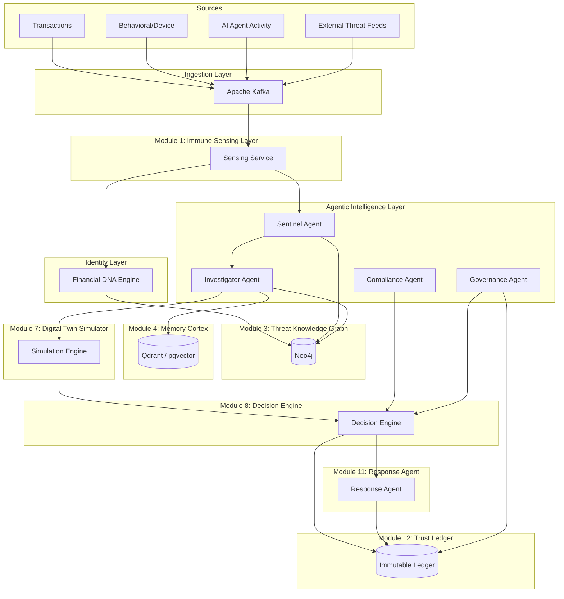
```mermaid
graph TB
    subgraph "Sources"
        S1[Transactions]
        S2[Behavioral/Device]
        S3[AI Agent Activity]
        S4[External Threat Feeds]
    end

    subgraph "Ingestion Layer"
        K[Apache Kafka]
    end

    subgraph "Module 1: Immune Sensing Layer"
        ISL[Sensing Service]
    end

    subgraph "Identity Layer"
        FDE[Financial DNA Engine]
    end

    subgraph "Module 3: Threat Knowledge Graph"
        TKG[(Neo4j)]
    end

    subgraph "Module 4: Memory Cortex"
        MC[(Qdrant / pgvector)]
    end

    subgraph "Agentic Intelligence Layer"
        SA[Sentinel Agent]
        IA[Investigator Agent]
        CA[Compliance Agent]
        GA[Governance Agent]
    end

    subgraph "Module 7: Digital Twin Simulator"
        DTS[Simulation Engine]
    end

    subgraph "Module 8: Decision Engine"
        DE[Decision Engine]
    end

    subgraph "Module 11: Response Agent"
        RA[Response Agent]
    end

    subgraph "Module 12: Trust Ledger"
        TL[(Immutable Ledger)]
    end

    S1 & S2 & S3 & S4 --> K
    K --> ISL
    ISL --> FDE
    ISL --> SA
    FDE --> TKG
    SA --> TKG
    SA --> IA
    IA --> TKG
    IA --> MC
    IA --> DTS
    DTS --> DE
    CA --> DE
    GA --> DE
    DE --> RA
    DE --> TL
    RA --> TL
    GA --> TL
```

## 8.1 Logical Architecture Layers

1. **Sensing Layer** — ingests all raw signals (Kafka topics per source type).
2. **Identity Layer** — Financial DNA Engine builds/updates live entity profiles.
3. **Knowledge Layer** — Neo4j graph + Memory Cortex (vector DB) provide relational + semantic context.
4. **Cognitive Layer** — Multi-agent system (Sentinel, Investigator, Compliance, Governance) reasons over the data.
5. **Foresight Layer** — Digital Twin simulates candidate outcomes.
6. **Decisioning Layer** — Decision Engine fuses all signals into one recommended action.
7. **Action Layer** — Response Agent executes; integrates with core banking APIs.
8. **Trust Layer** — Trust Ledger records everything immutably for audit.


---

# 9. Low-Level Design (LLD) — Per Module

For every module: **Responsibilities → Inputs → Outputs → API → Data Model → Workflow → Sequence Diagram.**

## 9.1 Module 1 — Immune Sensing Layer

**Responsibilities:** Normalize and route every signal (transaction, behavioral, agent, external) into standardized event envelopes; deduplicate; enrich with timestamps and source metadata.

**Inputs:** Raw events from core banking, mobile SDK telemetry, agent runtime logs, threat-intel feeds.

**Outputs:** `risk_context` enriched event published to Kafka topic `events.enriched`.

**API:**
```
POST /v1/events/ingest
{
  "source": "transaction|behavioral|agent|external",
  "payload": { ... }
}
→ 202 Accepted { "event_id": "evt_123" }
```

**Data Model:**
```json
{
  "event_id": "string (uuid)",
  "source_type": "enum",
  "entity_refs": {"customer_id": "", "device_id": "", "agent_id": ""},
  "timestamp": "ISO8601",
  "raw_payload": {},
  "risk_context": "generated"
}
```

**Workflow:** Ingest → Validate schema → Deduplicate (idempotency key) → Enrich → Publish to Kafka.

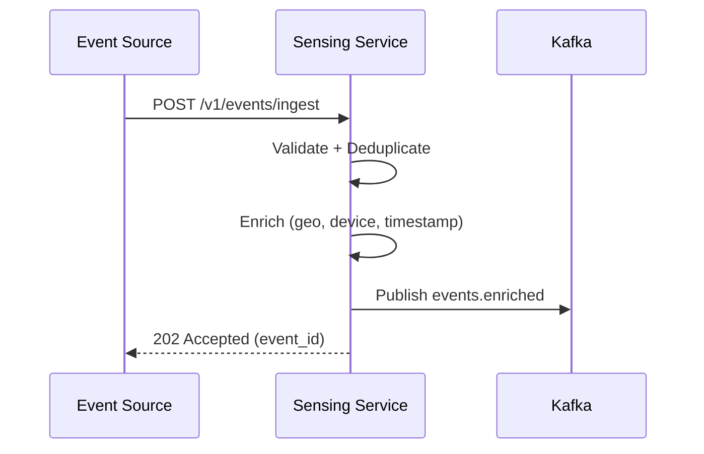
```mermaid
sequenceDiagram
    participant Src as Event Source
    participant ISL as Sensing Service
    participant K as Kafka
    Src->>ISL: POST /v1/events/ingest
    ISL->>ISL: Validate + Deduplicate
    ISL->>ISL: Enrich (geo, device, timestamp)
    ISL->>K: Publish events.enriched
    ISL-->>Src: 202 Accepted (event_id)
```

## 9.2 Module 2 — Financial DNA Engine

**Responsibilities:** Maintain live, continuously-updated profiles (Customer DNA, Device DNA, Agent DNA) used by every downstream module.

**Inputs:** `events.enriched` stream.

**Outputs:** Updated DNA profile documents; `dna.updated` event.

**API:**
```
GET /v1/dna/customer/{customer_id}
GET /v1/dna/device/{device_id}
GET /v1/dna/agent/{agent_id}
```

**Data Model (Customer DNA):**
```json
{
  "customer_id": "string",
  "spending_pattern": {"avg_txn": 0, "categories": {}},
  "risk_history": [{"event_id": "", "risk": 0, "date": ""}],
  "behavior_pattern": {"login_times": [], "typical_devices": []},
  "trust_score": 0.0,
  "updated_at": "ISO8601"
}
```

**Data Model (Agent DNA):**
```json
{
  "agent_id": "string",
  "decision_history": [{"decision_id": "", "outcome": ""}],
  "accuracy": 0.0,
  "failure_rate": 0.0,
  "bias_score": 0.0,
  "trust_score": 0.0
}
```

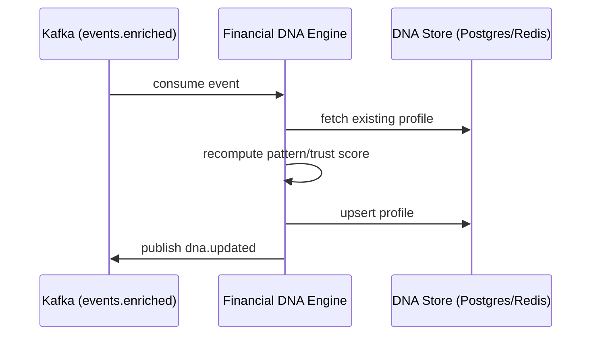
```mermaid
sequenceDiagram
    participant K as Kafka (events.enriched)
    participant FDE as Financial DNA Engine
    participant DB as DNA Store (Postgres/Redis)
    K->>FDE: consume event
    FDE->>DB: fetch existing profile
    FDE->>FDE: recompute pattern/trust score
    FDE->>DB: upsert profile
    FDE->>K: publish dna.updated
```

## 9.3 Module 3 — Threat Knowledge Graph

**Responsibilities:** Persist entity relationships (Customer-Device-Transaction-Merchant-IP-Agent) and run graph algorithms (community detection, shortest path, centrality) to surface hidden attack chains.

**Inputs:** `events.enriched`, `dna.updated`.

**Outputs:** Graph relationship updates; fraud-ring cluster alerts.

**API:**
```
POST /v1/graph/query   { "cypher": "MATCH ..." }
GET  /v1/graph/entity/{id}/neighbors?depth=2
GET  /v1/graph/clusters?min_size=5
```

**Cypher Example:**
```cypher
MATCH (c1:Customer)-[:USES]->(d:Device)<-[:USES]-(c2:Customer)
WHERE c1 <> c2
WITH d, collect(DISTINCT c1) + collect(DISTINCT c2) AS customers
WHERE size(customers) > 10
RETURN d, customers
```

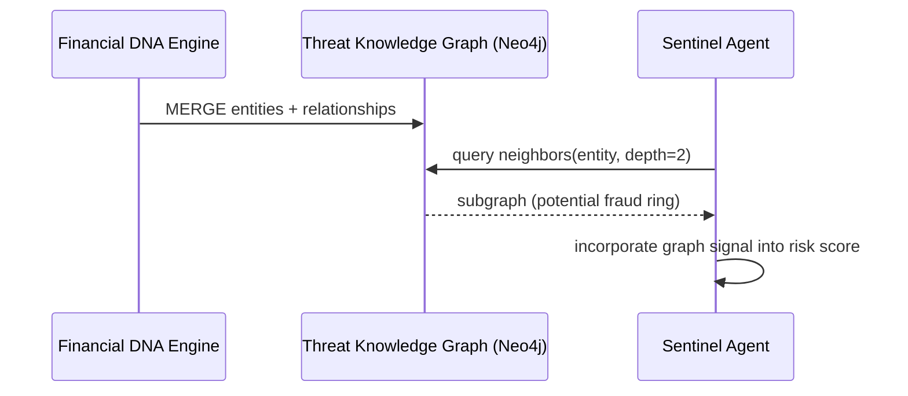
```mermaid
sequenceDiagram
    participant FDE as Financial DNA Engine
    participant TKG as Threat Knowledge Graph (Neo4j)
    participant SA as Sentinel Agent
    FDE->>TKG: MERGE entities + relationships
    SA->>TKG: query neighbors(entity, depth=2)
    TKG-->>SA: subgraph (potential fraud ring)
    SA->>SA: incorporate graph signal into risk score
```

## 9.4 Module 4 — Memory Cortex

**Responsibilities:** Institutional memory — store embeddings of every closed case (fraud, AML, cyber, compliance, analyst decision) and retrieve top-K similar cases with resolution + confidence.

**Inputs:** Case records (closed investigations), new event context.

**Outputs:** Ranked similar-case list with `resolution` and `confidence`.

**API:**
```
POST /v1/memory/search
{ "query_embedding_source": "event_id", "top_k": 10 }
→ {
  "results": [
    {"case_id": "c_88", "similarity": 0.91, "category": "Account Takeover",
     "resolution": "Temporary Freeze", "confidence": 0.91}
  ]
}
POST /v1/memory/ingest_case
```

**Data Model:**
```json
{
  "case_id": "string",
  "embedding": "vector(1536)",
  "category": "fraud|aml|cyber|compliance",
  "narrative": "text",
  "resolution": "string",
  "outcome_success": true,
  "closed_at": "ISO8601"
}
```

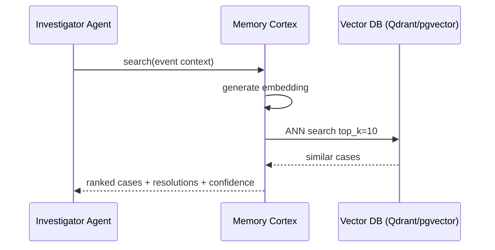
```mermaid
sequenceDiagram
    participant IA as Investigator Agent
    participant MC as Memory Cortex
    participant VDB as Vector DB (Qdrant/pgvector)
    IA->>MC: search(event context)
    MC->>MC: generate embedding
    MC->>VDB: ANN search top_k=10
    VDB-->>MC: similar cases
    MC-->>IA: ranked cases + resolutions + confidence
```

## 9.5 Module 5 — Sentinel Agent (Detection)

**Responsibilities:** Real-time risk scoring using ensemble of Isolation Forest (behavioral anomalies), XGBoost (risk scoring), GNN (network attacks), and sequence models (transaction patterns).

**API:**
```
POST /v1/sentinel/score
{ "event_id": "evt_123" }
→ { "risk": 92, "category": "Account Takeover", "model_contributions": {...} }
```

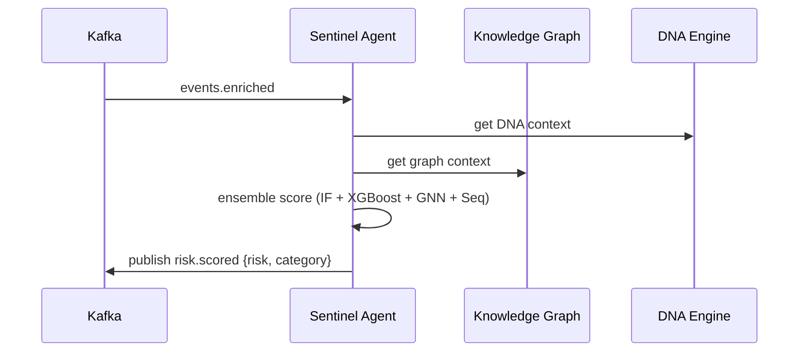
```mermaid
sequenceDiagram
    participant K as Kafka
    participant SA as Sentinel Agent
    participant TKG as Knowledge Graph
    participant FDE as DNA Engine
    K->>SA: events.enriched
    SA->>FDE: get DNA context
    SA->>TKG: get graph context
    SA->>SA: ensemble score (IF + XGBoost + GNN + Seq)
    SA->>K: publish risk.scored {risk, category}
```

## 9.6 Module 6 — Investigator Agent (Root Cause)

**Responsibilities:** Explain *why* an event was flagged using graph data, Memory Cortex, and regulatory knowledge.

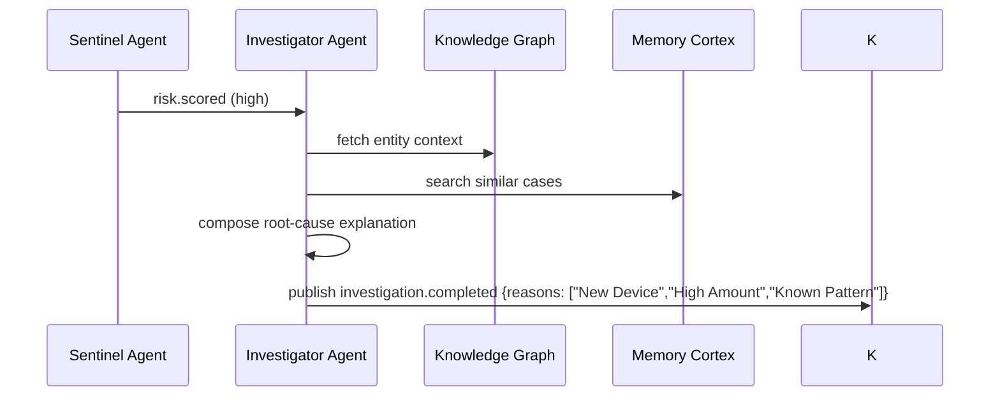
```mermaid
sequenceDiagram
    participant SA as Sentinel Agent
    participant IA as Investigator Agent
    participant TKG as Knowledge Graph
    participant MC as Memory Cortex
    SA->>IA: risk.scored (high)
    IA->>TKG: fetch entity context
    IA->>MC: search similar cases
    IA->>IA: compose root-cause explanation
    IA->>K: publish investigation.completed {reasons: ["New Device","High Amount","Known Pattern"]}
```

## 9.7 Module 7 — Financial Digital Twin

**Responsibilities:** Simulate candidate actions against a virtual replica of the customer/account/portfolio and predict financial + experience outcomes.

**API:**
```
POST /v1/twin/simulate
{ "entity_id": "...", "candidate_actions": ["approve","verify","freeze"] }
→ {
  "scenarios": [
    {"action":"approve","predicted_fraud_loss": 800000},
    {"action":"verify","predicted_loss": 20000},
    {"action":"freeze","predicted_churn_pct": 15}
  ]
}
```

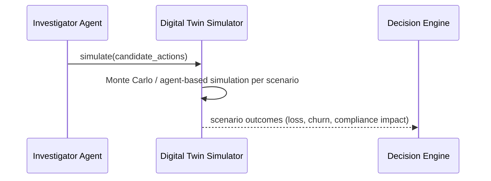
```mermaid
sequenceDiagram
    participant IA as Investigator Agent
    participant DTS as Digital Twin Simulator
    participant DE as Decision Engine
    IA->>DTS: simulate(candidate_actions)
    DTS->>DTS: Monte Carlo / agent-based simulation per scenario
    DTS-->>DE: scenario outcomes (loss, churn, compliance impact)
```

## 9.8 Module 8 — Decision Engine

**Responsibilities:** Fuse detection + memory + simulation + compliance signals into a single recommended action with confidence and rationale.

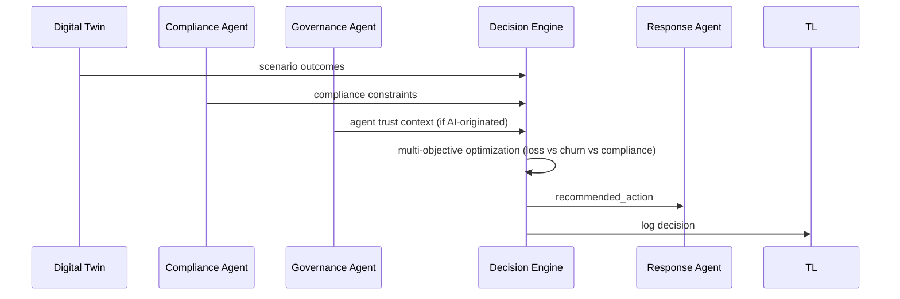
```mermaid
sequenceDiagram
    participant DTS as Digital Twin
    participant CA as Compliance Agent
    participant GA as Governance Agent
    participant DE as Decision Engine
    participant RA as Response Agent
    DTS->>DE: scenario outcomes
    CA->>DE: compliance constraints
    GA->>DE: agent trust context (if AI-originated)
    DE->>DE: multi-objective optimization (loss vs churn vs compliance)
    DE->>RA: recommended_action
    DE->>TL: log decision
```

## 9.9 Module 9 — Compliance Agent

**Responsibilities:** Evaluate AML/KYC/RBI/internal policy compliance; generate regulator-ready explanations and reports.

**API:**
```
POST /v1/compliance/check {entity_id, transaction_id}
GET  /v1/compliance/report?period=Q1-2026
```

## 9.10 Module 10 — Governance Agent

**Responsibilities:** Monitor AI systems themselves — track which agent made a decision, on what data, with what historical accuracy, and whether it's auditable. Computes/updates Agent DNA trust scores; flags bias drift.

**API:**
```
GET /v1/governance/agent/{agent_id}/scorecard
POST /v1/governance/audit {agent_id, decision_id}
```

## 9.11 Module 11 — Response Agent

**Responsibilities:** Execute the recommended action via integration APIs (OTP/MFA provider, core banking hold/freeze APIs).

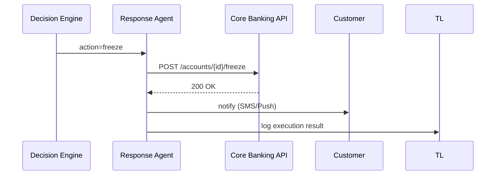
```mermaid
sequenceDiagram
    participant DE as Decision Engine
    participant RA as Response Agent
    participant CoreBank as Core Banking API
    participant Cust as Customer
    DE->>RA: action=freeze
    RA->>CoreBank: POST /accounts/{id}/freeze
    CoreBank-->>RA: 200 OK
    RA->>Cust: notify (SMS/Push)
    RA->>TL: log execution result
```

## 9.12 Module 12 — Trust Ledger

**Responsibilities:** Append-only, hash-chained, immutable record of every decision, simulation, reasoning chain, and human override; future cryptographic + post-quantum signing.

**Data Model:**
```json
{
  "ledger_id": "string",
  "prev_hash": "sha256",
  "entry_hash": "sha256",
  "decision_id": "string",
  "agent_chain": ["sentinel","investigator","decision_engine","response"],
  "payload": {},
  "signature": "ed25519/dilithium",
  "timestamp": "ISO8601"
}
```

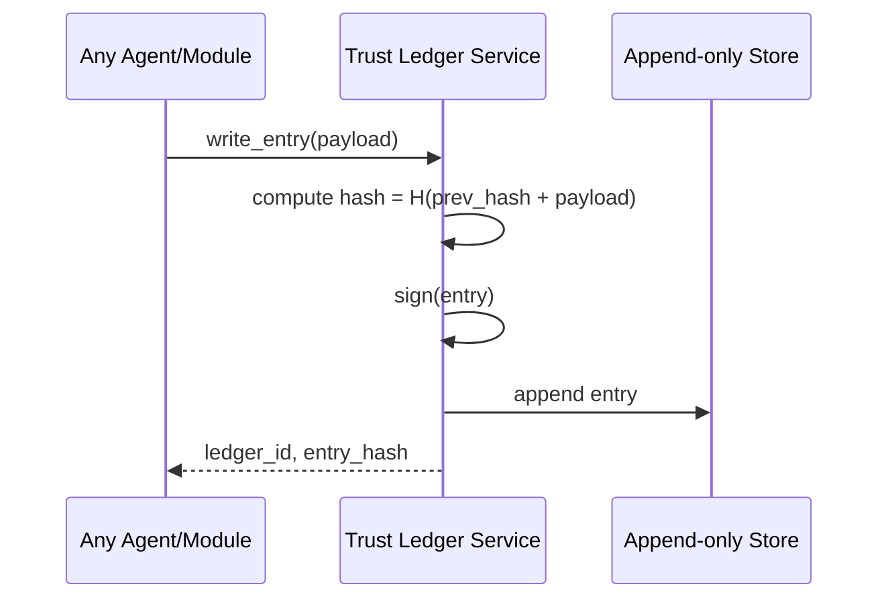
```mermaid
sequenceDiagram
    participant Any as Any Agent/Module
    participant TL as Trust Ledger Service
    participant DB as Append-only Store
    Any->>TL: write_entry(payload)
    TL->>TL: compute hash = H(prev_hash + payload)
    TL->>TL: sign(entry)
    TL->>DB: append entry
    TL-->>Any: ledger_id, entry_hash
```


---

# 10. Component Architecture

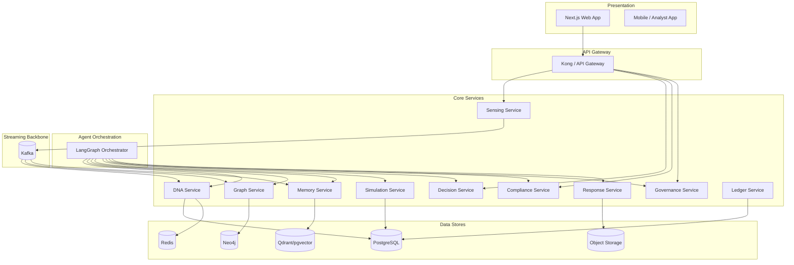
```mermaid
graph TB
    subgraph "Presentation"
        WEB[Next.js Web App]
        MOB[Mobile / Analyst App]
    end
    subgraph "API Gateway"
        GW[Kong / API Gateway]
    end
    subgraph "Core Services"
        SVC1[Sensing Service]
        SVC2[DNA Service]
        SVC3[Graph Service]
        SVC4[Memory Service]
        SVC5[Simulation Service]
        SVC6[Decision Service]
        SVC7[Compliance Service]
        SVC8[Governance Service]
        SVC9[Response Service]
        SVC10[Ledger Service]
    end
    subgraph "Agent Orchestration"
        ORCH[LangGraph Orchestrator]
    end
    subgraph "Data Stores"
        PG[(PostgreSQL)]
        NEO[(Neo4j)]
        VDB[(Qdrant/pgvector)]
        REDIS[(Redis)]
        S3[(Object Storage)]
    end
    subgraph "Streaming Backbone"
        KAFKA[(Kafka)]
    end

    WEB --> GW --> SVC1
    GW --> SVC6
    GW --> SVC7
    GW --> SVC8
    SVC1 --> KAFKA
    KAFKA --> SVC2 & SVC3 & SVC4
    ORCH --> SVC2 & SVC3 & SVC4 & SVC5 & SVC6 & SVC7 & SVC8 & SVC9
    SVC2 --> PG & REDIS
    SVC3 --> NEO
    SVC4 --> VDB
    SVC5 --> PG
    SVC10 --> PG
    SVC9 --> S3
```

---

# 11. Microservices Architecture

| Service | Responsibility | Language | Data Store | Scaling Pattern |
|---|---|---|---|---|
| `sensing-service` | Event ingestion/normalization | Python (FastAPI) | Kafka | Horizontal, stateless |
| `dna-service` | Customer/Device/Agent DNA profiles | Python | PostgreSQL + Redis | Horizontal, partitioned by entity_id |
| `graph-service` | Graph queries, relationship writes | Python/Java | Neo4j | Read replicas |
| `memory-service` | Embedding + similarity search | Python | Qdrant/pgvector | Sharded vector index |
| `sentinel-service` | ML risk scoring | Python | Redis cache + model registry | GPU/CPU autoscale |
| `investigator-service` | Root cause LLM reasoning | Python | — (calls graph+memory) | Stateless, LLM-bound |
| `twin-service` | Digital twin simulation | Python | PostgreSQL | Compute-heavy, batch+stream |
| `decision-service` | Action recommendation | Python | PostgreSQL | Stateless |
| `compliance-service` | Rule evaluation, reporting | Python | PostgreSQL | Stateless |
| `governance-service` | Agent auditing & trust scoring | Python | PostgreSQL | Stateless |
| `response-service` | Action execution | Python | — (calls core banking) | Stateless, idempotent |
| `ledger-service` | Immutable audit log | Go/Rust | PostgreSQL (append-only) / future blockchain | Append-optimized |

## 11.1 Inter-Service Communication

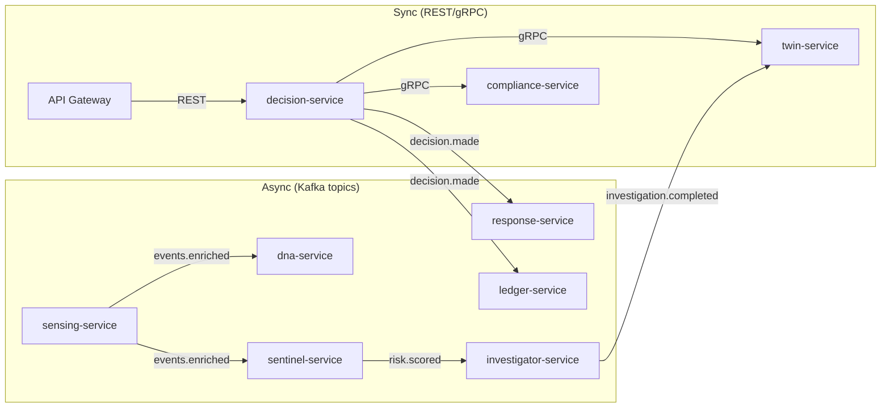
```mermaid
graph LR
    subgraph "Sync (REST/gRPC)"
        GW2[API Gateway] -->|REST| decision-service
        decision-service -->|gRPC| twin-service
        decision-service -->|gRPC| compliance-service
    end
    subgraph "Async (Kafka topics)"
        sensing-service -->|events.enriched| dna-service
        sensing-service -->|events.enriched| sentinel-service
        sentinel-service -->|risk.scored| investigator-service
        investigator-service -->|investigation.completed| twin-service
        decision-service -->|decision.made| response-service
        decision-service -->|decision.made| ledger-service
    end
```

---

# 12. Multi-Agent Architecture

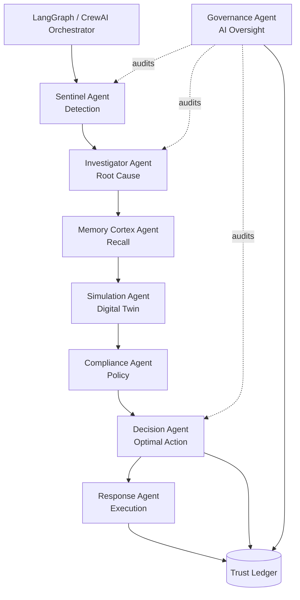
```mermaid
graph TD
    Orchestrator[LangGraph / CrewAI Orchestrator]
    Orchestrator --> Sentinel[Sentinel Agent\nDetection]
    Sentinel --> Investigator[Investigator Agent\nRoot Cause]
    Investigator --> MemoryAgent[Memory Cortex Agent\nRecall]
    MemoryAgent --> Simulation[Simulation Agent\nDigital Twin]
    Simulation --> Compliance[Compliance Agent\nPolicy]
    Compliance --> Decision[Decision Agent\nOptimal Action]
    Decision --> Response[Response Agent\nExecution]
    Governance[Governance Agent\nAI Oversight] -.audits.-> Sentinel
    Governance -.audits.-> Investigator
    Governance -.audits.-> Decision
    Response --> Ledger[(Trust Ledger)]
    Decision --> Ledger
    Governance --> Ledger
```

## 12.1 Agent Communication Protocol

- **Orchestration framework:** LangGraph (stateful graph execution) for the core pipeline; CrewAI optional for ad-hoc, role-based agent crews (e.g., report-writing crews).
- **Message format:** structured JSON "Agent Envelope":
```json
{
  "trace_id": "uuid",
  "from_agent": "sentinel",
  "to_agent": "investigator",
  "payload": {},
  "confidence": 0.0,
  "timestamp": "ISO8601"
}
```
- **State management:** Shared state object passed through the LangGraph graph; persisted checkpoint after each node for resumability.
- **Failure handling:** Each agent node has a retry policy (3 retries, exponential backoff) and a fallback rule-based path if the LLM/ML call fails (graceful degradation to deterministic rules).

## 12.2 Agent Roles & Autonomy Levels

| Agent | Autonomy | Can Act Without Human? | Escalation Trigger |
|---|---|---|---|
| Sentinel | Full | Yes (scoring only) | N/A |
| Investigator | Full | Yes (explanation only) | N/A |
| Memory Cortex Agent | Full | Yes (retrieval only) | N/A |
| Simulation Agent | Full | Yes (simulation only) | N/A |
| Compliance Agent | Conditional | Yes for pass; No for ambiguous | Policy ambiguity |
| Governance Agent | Full (oversight) | Yes (monitoring); No (cannot self-approve) | Trust score < threshold |
| Decision Agent | Conditional | Yes for Low/Medium risk | High risk → human review |
| Response Agent | Conditional | Yes for OTP/Hold; No for Freeze > ₹X | Freeze/Block above threshold |


---

# 13. Data Flow Diagrams

## 13.1 Level-0 DFD (Context Diagram)

```mermaid
graph LR
    Ext1[Core Banking System] --> AEGISFI((AEGIS-FI))
    Ext2[Mobile/Web Apps] --> AEGISFI
    Ext3[Threat Intel Feeds] --> AEGISFI
    Ext4[AI Trading/Lending Agents] --> AEGISFI
    AEGISFI --> Out1[Fraud Ops Dashboard]
    AEGISFI --> Out2[Regulator Reports]
    AEGISFI --> Out3[Core Banking Action APIs]
    AEGISFI --> Out4[Customer Notifications]
```

## 13.2 Level-1 DFD

```mermaid
graph TB
    P1((1.0\nIngest & Normalize))
    P2((2.0\nBuild/Update DNA))
    P3((3.0\nDetect Risk))
    P4((4.0\nInvestigate))
    P5((5.0\nSimulate))
    P6((6.0\nDecide))
    P7((7.0\nAct))
    P8((8.0\nRecord))

    D1[(Event Store)]
    D2[(DNA Store)]
    D3[(Knowledge Graph)]
    D4[(Memory Cortex)]
    D5[(Trust Ledger)]

    P1 --> D1
    D1 --> P2 --> D2
    D1 --> P3
    D2 --> P3
    D3 --> P3
    P3 --> P4
    D4 --> P4
    D3 --> P4
    P4 --> P5
    P5 --> P6
    D4 --> P6
    P6 --> P7
    P6 --> D5
    P7 --> D5
    P7 --> Out[Core Banking / Customer]
```

## 13.3 Real-Time Transaction Scoring Data Flow

```mermaid
flowchart LR
    TXN[Transaction Event] --> KAFKA[Kafka: events.raw]
    KAFKA --> ENRICH[Enrichment Service]
    ENRICH --> KAFKA2[Kafka: events.enriched]
    KAFKA2 --> SENTINEL[Sentinel Agent]
    SENTINEL --> SCORE{Risk >= Threshold?}
    SCORE -- No --> ALLOW[Allow Transaction]
    SCORE -- Yes --> INVESTIGATOR[Investigator Agent]
    INVESTIGATOR --> TWIN[Digital Twin]
    TWIN --> DECISION[Decision Engine]
    DECISION --> RESPONSE[Response Agent]
    RESPONSE --> LEDGER[(Trust Ledger)]
    ALLOW --> LEDGER
```

---

# 14. Sequence Diagrams

## 14.1 End-to-End: High-Risk Transaction

```mermaid
sequenceDiagram
    autonumber
    participant U as Customer/Agent
    participant ISL as Sensing Layer
    participant FDE as DNA Engine
    participant TKG as Knowledge Graph
    participant SA as Sentinel Agent
    participant IA as Investigator Agent
    participant MC as Memory Cortex
    participant DTS as Digital Twin
    participant CA as Compliance Agent
    participant DE as Decision Engine
    participant RA as Response Agent
    participant TL as Trust Ledger

    U->>ISL: Submit transaction
    ISL->>FDE: enrich with DNA context
    FDE->>TKG: update relationships
    ISL->>SA: events.enriched
    SA->>TKG: query graph context
    SA->>SA: ensemble scoring
    SA-->>IA: risk.scored (92, Account Takeover)
    IA->>TKG: fetch entity neighbors
    IA->>MC: search similar cases
    MC-->>IA: 84 similar cases (Freeze, 91% confidence)
    IA-->>DTS: investigation.completed
    DTS->>DTS: simulate approve/verify/freeze
    DTS-->>CA: scenario outcomes
    CA->>CA: check AML/KYC/RBI rules
    CA-->>DE: compliance constraints
    DE->>DE: select optimal action (freeze)
    DE->>RA: execute(freeze)
    RA->>U: notify customer
    DE->>TL: log decision chain
    RA->>TL: log execution
```

## 14.2 Agent Governance Audit Sequence

```mermaid
sequenceDiagram
    autonumber
    participant Sched as Scheduler
    participant GA as Governance Agent
    participant TL as Trust Ledger
    participant FDE as DNA Engine (Agent DNA)
    Sched->>GA: trigger periodic audit
    GA->>TL: fetch agent decision records
    GA->>GA: compute accuracy, bias, failure rate
    GA->>FDE: update Agent DNA trust_score
    GA->>TL: log audit result
    alt trust_score below threshold
        GA->>DE: flag agent for human review
    end
```

---

# 15. Entity Relationship Diagrams

```mermaid
erDiagram
    CUSTOMER ||--o{ ACCOUNT : owns
    CUSTOMER ||--o{ DEVICE_LINK : uses
    DEVICE ||--o{ DEVICE_LINK : linked_via
    ACCOUNT ||--o{ TRANSACTION : has
    TRANSACTION }o--|| MERCHANT : paid_to
    TRANSACTION ||--o{ RISK_SCORE : scored_by
    CUSTOMER ||--o{ CASE : subject_of
    CASE ||--o{ CASE_EMBEDDING : has
    AGENT ||--o{ DECISION : makes
    DECISION ||--o{ LEDGER_ENTRY : recorded_as
    DECISION }o--|| TRANSACTION : about
    AGENT ||--o{ AGENT_DNA : described_by
    CUSTOMER ||--o{ CUSTOMER_DNA : described_by
    DEVICE ||--o{ DEVICE_DNA : described_by

    CUSTOMER {
        uuid customer_id PK
        string name
        string kyc_status
        float trust_score
        timestamp created_at
    }
    ACCOUNT {
        uuid account_id PK
        uuid customer_id FK
        string account_type
        decimal balance
    }
    DEVICE {
        uuid device_id PK
        string fingerprint
        string geo_history
    }
    TRANSACTION {
        uuid txn_id PK
        uuid account_id FK
        decimal amount
        string status
        timestamp created_at
    }
    RISK_SCORE {
        uuid score_id PK
        uuid txn_id FK
        int risk_value
        string category
        timestamp scored_at
    }
    CASE {
        uuid case_id PK
        uuid customer_id FK
        string category
        string resolution
        bool outcome_success
    }
    CASE_EMBEDDING {
        uuid case_id FK
        vector embedding
    }
    AGENT {
        uuid agent_id PK
        string agent_type
        string model_version
    }
    DECISION {
        uuid decision_id PK
        uuid agent_id FK
        uuid txn_id FK
        string recommended_action
        float confidence
    }
    LEDGER_ENTRY {
        uuid ledger_id PK
        uuid decision_id FK
        string prev_hash
        string entry_hash
        string signature
        timestamp recorded_at
    }
    AGENT_DNA {
        uuid agent_id FK
        float accuracy
        float failure_rate
        float bias_score
        float trust_score
    }
    CUSTOMER_DNA {
        uuid customer_id FK
        json spending_pattern
        json behavior_pattern
        float trust_score
    }
    DEVICE_DNA {
        uuid device_id FK
        json fraud_association
        json geo_history
    }
```


---

# 16. Knowledge Graph Design

## 16.1 Graph Schema (Neo4j)

```mermaid
graph LR
    Customer((Customer)) -- USES --> Device((Device))
    Customer -- OWNS --> Account((Account))
    Account -- INITIATES --> Transaction((Transaction))
    Transaction -- PAID_TO --> Merchant((Merchant))
    Transaction -- FROM_IP --> IP((IP Address))
    Device -- SEEN_AT --> IP
    Agent((AI Agent)) -- DECIDED --> Transaction
    Customer -- LINKED_TO --> Customer
    Device -- ASSOCIATED_WITH --> FraudRing((Fraud Ring Cluster))
```

## 16.2 Node & Relationship Catalogue

| Node Label | Key Properties |
|---|---|
| `Customer` | customer_id, kyc_status, trust_score |
| `Device` | device_id, fingerprint, fraud_flag |
| `Account` | account_id, type, balance |
| `Transaction` | txn_id, amount, timestamp, status |
| `Merchant` | merchant_id, category, risk_tier |
| `IP` | ip_address, geo, asn |
| `Agent` | agent_id, model_version, trust_score |
| `FraudRing` (derived) | cluster_id, size, detected_at |

| Relationship | From → To | Properties |
|---|---|---|
| `USES` | Customer → Device | first_seen, last_seen |
| `OWNS` | Customer → Account | since |
| `INITIATES` | Account → Transaction | — |
| `PAID_TO` | Transaction → Merchant | — |
| `FROM_IP` | Transaction → IP | — |
| `SEEN_AT` | Device → IP | count |
| `DECIDED` | Agent → Transaction | confidence |
| `LINKED_TO` | Customer → Customer | shared_device/ip |

## 16.3 Graph Algorithms Used

- **Community Detection (Louvain/Label Propagation):** surface fraud rings — clusters of customers sharing devices/IPs.
- **Shortest Path:** trace how a compromised device connects to a victim account.
- **Centrality (PageRank/Betweenness):** identify "hub" entities (mule accounts, shared infrastructure).
- **Pattern Matching (Cypher):** the "50 accounts → same device → same IP" detection pattern from the PRD.

```cypher
// Fraud ring detection example
CALL gds.louvain.stream('customerDeviceGraph')
YIELD nodeId, communityId
WITH communityId, collect(gds.util.asNode(nodeId)) AS members
WHERE size(members) > 10
RETURN communityId, members
```

---

# 17. RAG Architecture

```mermaid
graph TB
    subgraph "Ingestion Pipeline"
        Case[Closed Case / Document] --> Chunk[Chunking]
        Chunk --> Embed[Embedding Model]
        Embed --> VDB[(Vector DB: Qdrant/pgvector)]
    end
    subgraph "Retrieval Pipeline"
        Query[Incoming Event/Question] --> QEmbed[Query Embedding]
        QEmbed --> ANN[ANN Search]
        VDB --> ANN
        ANN --> Rerank[Re-ranking Cross-Encoder]
        Rerank --> Context[Top-K Context]
    end
    subgraph "Generation"
        Context --> LLM[LLM: Gemini / Fine-tuned Llama-Mistral]
        LLM --> Answer[Grounded Explanation/Recommendation]
    end
```

## 17.1 RAG Design Decisions

| Decision | Choice | Rationale |
|---|---|---|
| Embedding model | `text-embedding-3-large` (or domain fine-tuned) | High recall on financial/legal language |
| Chunking strategy | Semantic chunking (per-case, not fixed token windows) | Cases are atomic units of institutional memory |
| Retrieval | Hybrid (BM25 + vector) | Keyword precision (account numbers, regulation codes) + semantic recall |
| Re-ranking | Cross-encoder re-rank top 50 → top 10 | Improves precision before LLM context injection |
| Grounding | Always cite `case_id` in generated explanation | Auditability — every claim traceable to a source case |
| Guardrails | Output schema validation (JSON mode) | Prevent hallucinated actions outside allowed action set |

---

# 18. Memory Cortex Architecture

> "Not chatbot RAG. Institutional memory." — the Memory Cortex differs from generic RAG by being **case-outcome-aware**: every record stores not just *what happened* but *what was done and whether it worked*.

```mermaid
graph TB
    NewEvent[New Event] --> Embed2[Embed Event Context]
    Embed2 --> Search[Similarity Search]
    Search --> VDB2[(Vector DB)]
    VDB2 --> Results[Top-K Similar Cases]
    Results --> Aggregate[Aggregate Resolutions + Confidence]
    Aggregate --> Output["Found 84 similar cases.\nMost Similar: Account Takeover\nSuccess Response: Temporary Freeze\nConfidence: 91%"]

    subgraph "Continuous Learning Loop"
        CaseClosed[Case Closed] --> Outcome[Record Outcome Success/Failure]
        Outcome --> ReEmbed[Re-embed with outcome metadata]
        ReEmbed --> VDB2
    end
```

## 18.1 Memory Cortex Data Model

```json
{
  "case_id": "uuid",
  "embedding": "vector(1536)",
  "category": "fraud|aml|cyber|compliance",
  "entities_involved": ["customer_id","device_id"],
  "narrative": "text summary of investigation",
  "resolution": "Temporary Freeze",
  "outcome_success": true,
  "confidence_at_resolution": 0.91,
  "analyst_id": "string|null",
  "closed_at": "ISO8601"
}
```

## 18.2 Confidence Scoring Formula

```
confidence = (similarity_score * 0.5) + (outcome_success_rate_of_top_k * 0.3) + (recency_weight * 0.2)
```

This ensures recommendations favor not just *similar* cases but cases that **worked** and are **recent** (regulatory/behavioral drift awareness).

---

# 19. Digital Twin Architecture

```mermaid
graph TB
    Entity[Customer / Account / Portfolio] --> TwinBuilder[Twin State Builder]
    TwinBuilder --> TwinState[(Virtual Replica State)]
    TwinState --> ScenarioEngine[Scenario Engine]
    ScenarioEngine --> ScenA[Scenario: Approve]
    ScenarioEngine --> ScenB[Scenario: Verify]
    ScenarioEngine --> ScenC[Scenario: Freeze]
    ScenA --> MonteCarlo1[Monte Carlo: Fraud Loss Model]
    ScenB --> MonteCarlo2[Monte Carlo: Friction/Loss Model]
    ScenC --> MonteCarlo3[Agent-Based: Churn Model]
    MonteCarlo1 --> Results[Predicted Outcomes]
    MonteCarlo2 --> Results
    MonteCarlo3 --> Results
    Results --> DecisionEngine2[Decision Engine: pick optimal]
```

## 19.1 Simulation Models

| Scenario Type | Model | Predicts |
|---|---|---|
| Approve | Historical fraud-loss distribution + GBM | ₹ expected fraud loss |
| Verify (step-up) | Friction/abandonment regression | ₹ expected loss + drop-off rate |
| Freeze | Survival/churn model on historical freeze events | % customer churn |
| Portfolio-level | Agent-based simulation (multi-customer interactions) | Systemic risk exposure |

## 19.2 Digital Twin State Object

```json
{
  "entity_id": "string",
  "entity_type": "customer|account|portfolio|institution",
  "current_state": {
    "balance": 0, "risk_score": 0, "recent_txns": []
  },
  "behavioral_model_params": {},
  "last_synced": "ISO8601"
}
```


---

# 20. Event-Driven Architecture

```mermaid
graph TB
    subgraph "Kafka Topics"
        T1[events.raw]
        T2[events.enriched]
        T3[dna.updated]
        T4[risk.scored]
        T5[investigation.completed]
        T6[simulation.completed]
        T7[decision.made]
        T8[action.executed]
        T9[ledger.recorded]
        T10[governance.audit]
    end

    Sources --> T1 --> SensingSvc[Sensing Service] --> T2
    T2 --> DNASvc[DNA Service] --> T3
    T2 --> SentinelSvc[Sentinel Service] --> T4
    T4 --> InvestigatorSvc[Investigator Service] --> T5
    T5 --> TwinSvc[Twin Service] --> T6
    T6 --> DecisionSvc[Decision Service] --> T7
    T7 --> ResponseSvc[Response Service] --> T8
    T7 --> LedgerSvc[Ledger Service] --> T9
    T8 --> LedgerSvc
    T9 --> GovernanceSvc[Governance Service] --> T10
```

## 20.1 Topic Design

| Topic | Partitions (Enterprise) | Key | Retention |
|---|---|---|---|
| `events.raw` | 100 | entity_id | 7 days |
| `events.enriched` | 100 | entity_id | 30 days |
| `risk.scored` | 50 | txn_id | 90 days |
| `decision.made` | 50 | decision_id | 7 years (compliance) |
| `ledger.recorded` | 20 | ledger_id | Infinite (cold storage tiered) |

## 20.2 Delivery Guarantees

- **At-least-once** delivery with idempotent consumers (idempotency key = `event_id`) across all services.
- **Exactly-once** semantics for Trust Ledger writes via transactional outbox pattern + Kafka transactions.
- **Dead-letter queues** (`*.dlq`) for poison messages, with alerting to on-call.

---

# 21. Security Architecture

```mermaid
graph TB
    subgraph "Perimeter"
        WAF[WAF / DDoS Protection]
        APIGW[API Gateway + OAuth2/OIDC]
    end
    subgraph "Identity & Access"
        IAM[IAM / RBAC / ABAC]
        MFA[MFA for Analysts/Admins]
    end
    subgraph "Data Security"
        ENC1[TLS 1.3 in transit]
        ENC2[AES-256 at rest]
        HSM[HSM-backed Key Management]
        TOKEN[Tokenization of PII/PAN]
    end
    subgraph "Application Security"
        SAST[SAST/DAST in CI/CD]
        SECRETS[Secrets Manager / Vault]
        SANDBOX[Agent Sandbox/Guardrails]
    end
    subgraph "Network Security"
        VPC[Private VPC + Subnetting]
        SVCMESH[mTLS Service Mesh - Istio]
        NSG[Network Security Groups]
    end
    subgraph "Detection & Response"
        SIEM[SIEM Integration]
        IDS[IDS/IPS]
    end

    WAF --> APIGW --> IAM
    IAM --> MFA
    APIGW --> SVCMESH
    SVCMESH --> VPC --> NSG
    ENC1 & ENC2 --> HSM
    SAST & SECRETS & SANDBOX --> SVCMESH
    SVCMESH --> SIEM --> IDS
```

## 21.1 Security Controls by Layer

| Layer | Control |
|---|---|
| Network | Private VPC, no public DB endpoints, NSGs, mTLS service mesh (Istio/Linkerd) |
| Identity | OAuth2/OIDC, RBAC + ABAC for analyst/agent permissions, short-lived JWTs |
| Data | Field-level encryption for PII, tokenization of card/account numbers, AES-256 at rest |
| Secrets | HashiCorp Vault / cloud KMS, no secrets in code or env files |
| AI/Agent | Prompt-injection guardrails, output schema validation, sandboxed tool execution, rate-limited agent actions |
| Application | SAST (Semgrep), DAST (OWASP ZAP), dependency scanning (Snyk/Dependabot) in CI |
| Audit | Trust Ledger as security-relevant audit source, immutable, tamper-evident |
| Compliance | PCI-DSS Level 1 scope isolation, SOC 2 Type II controls, ISO 27001 ISMS, RBI cybersecurity framework, DPDP/GDPR data handling |

## 21.2 AI Agent Threat Model (STRIDE applied to Agents)

| Threat | Example | Mitigation |
|---|---|---|
| Spoofing | Fake agent impersonates a trusted agent | Mutual mTLS + signed agent identity tokens |
| Tampering | Prompt injection alters agent reasoning | Input sanitization, structured tool-calling only, output validation |
| Repudiation | Agent denies making a decision | Trust Ledger immutable signed record per decision |
| Information Disclosure | Agent leaks PII in explanation text | PII redaction filter on all agent outputs |
| Denial of Service | Agent loop / runaway cost | Rate limits, circuit breakers, max-iteration caps |
| Elevation of Privilege | Agent calls an action beyond its autonomy level | Action allow-list per agent + policy engine (OPA) enforcement |

---

# 22. Trust Ledger Architecture

```mermaid
graph LR
    Entry1[Decision Entry] --> Hash1[Hash with prev_hash]
    Hash1 --> Sign1[Sign - Ed25519]
    Sign1 --> Store1[(Append-only Store)]
    Store1 --> Entry2[Next Entry]
    Entry2 --> Hash2[Hash with prev_hash]
    Hash2 --> Sign2[Sign]
    Sign2 --> Store1

    Store1 --> Anchor[Periodic Merkle Root Anchoring]
    Anchor --> ExtChain[(Public Blockchain / Notary Service - V2+)]
```

## 22.1 Ledger Guarantees

1. **Append-only:** writes never update/delete; corrections are new compensating entries.
2. **Hash-chained:** each entry includes `H(prev_hash + payload)`, forming a tamper-evident chain (blockchain-style without requiring a public chain for MVP).
3. **Signed:** every entry signed with Ed25519 (MVP/V1); roadmap to post-quantum (CRYSTALS-Dilithium) signatures at enterprise scale (Section 29).
4. **Periodically anchored:** Merkle root of N entries optionally anchored to a public ledger or third-party notary for external verifiability (V2+).
5. **Queryable:** despite immutability, indexed for fast regulator queries (`decision_id`, `entity_id`, `date range`).

## 22.2 Ledger Entry Schema

```json
{
  "ledger_id": "uuid",
  "sequence_no": 10293,
  "prev_hash": "sha256:...",
  "entry_hash": "sha256:...",
  "decision_id": "uuid",
  "agent_chain": ["sentinel","investigator","decision_engine"],
  "payload": {
    "risk_score": 92,
    "category": "Account Takeover",
    "recommended_action": "freeze",
    "rationale_summary": "New device + high amount + known pattern",
    "human_override": null
  },
  "signature": "ed25519:...",
  "signer_key_id": "kms-key-001",
  "timestamp": "2026-06-21T10:15:00Z"
}
```


---

# 23. Deployment & Infrastructure Architecture

```mermaid
graph TB
    subgraph "Region: Primary (ap-south-1 / asia-south1)"
        subgraph "K8s Cluster - AZ1"
            PodsA[Service Pods]
        end
        subgraph "K8s Cluster - AZ2"
            PodsB[Service Pods]
        end
        LB1[Cloud Load Balancer]
        DBPrimary[(PostgreSQL Primary)]
        Neo4jPrimary[(Neo4j Cluster)]
        KafkaCluster[(Kafka Cluster - 3+ brokers)]
    end
    subgraph "Region: DR (ap-southeast-1)"
        DBReplica[(PostgreSQL Read Replica)]
        K8sDR[Standby K8s Cluster]
    end

    Internet --> CDN[CDN/WAF] --> LB1 --> PodsA & PodsB
    PodsA & PodsB --> DBPrimary
    PodsA & PodsB --> Neo4jPrimary
    PodsA & PodsB --> KafkaCluster
    DBPrimary -.async replication.-> DBReplica
    DBPrimary -.failover.-> K8sDR
```

## 23.1 Infrastructure Components

| Layer | Hackathon MVP | Enterprise Scale |
|---|---|---|
| Compute | Single Docker Compose / 1 VM | Kubernetes (GKE/EKS) multi-AZ, multi-region |
| Database | Single PostgreSQL instance | Postgres with read replicas + connection pooling (PgBouncer), partitioning |
| Graph DB | Single Neo4j instance | Neo4j Causal Cluster (3+ core, multiple read replicas) |
| Vector DB | pgvector (same Postgres) | Qdrant cluster (sharded, replicated) |
| Streaming | Single Kafka broker (or Redpanda) | Kafka cluster (3-5 brokers, replication factor 3) |
| Cache | Local Redis | Redis Cluster with sentinel/failover |
| Object Storage | Local disk | GCS/S3 with lifecycle policies |
| CDN/WAF | None | Cloudflare / Cloud Armor |
| Secrets | `.env` file | HashiCorp Vault / Cloud KMS |
| Observability | Console logs | Full stack (Section 28) |

## 23.2 Kubernetes Topology

```mermaid
graph TB
    subgraph "Namespace: aegis-core"
        D1[Deployment: sensing-service]
        D2[Deployment: dna-service]
        D3[Deployment: sentinel-service]
        D4[Deployment: investigator-service]
    end
    subgraph "Namespace: aegis-intel"
        D5[Deployment: twin-service]
        D6[Deployment: decision-service]
        D7[Deployment: compliance-service]
        D8[Deployment: governance-service]
    end
    subgraph "Namespace: aegis-trust"
        D9[Deployment: response-service]
        D10[StatefulSet: ledger-service]
    end
    subgraph "Namespace: aegis-data"
        SS1[StatefulSet: kafka]
        SS2[StatefulSet: neo4j]
        SS3[StatefulSet: qdrant]
    end
    HPA[HorizontalPodAutoscaler] --> D1 & D2 & D3
    Istio[Istio Service Mesh] -.mTLS.-> D1 & D2 & D3 & D4 & D5 & D6 & D7 & D8 & D9
```

---

# 24. API Design

## 24.1 API Principles

- REST for CRUD/query operations; gRPC for low-latency internal service-to-service calls; GraphQL gateway (optional) for the analyst dashboard to compose data from multiple services in one query.
- All APIs versioned (`/v1/...`), OAuth2 client-credentials for service-to-service, OIDC for human users.
- Idempotency-Key header required on all POST endpoints that trigger side effects.

## 24.2 Representative API Catalogue

```
POST   /v1/events/ingest
GET    /v1/dna/customer/{id}
GET    /v1/dna/device/{id}
GET    /v1/dna/agent/{id}
POST   /v1/graph/query
GET    /v1/graph/entity/{id}/neighbors
POST   /v1/memory/search
POST   /v1/memory/ingest_case
POST   /v1/sentinel/score
POST   /v1/investigator/explain
POST   /v1/twin/simulate
POST   /v1/decision/recommend
POST   /v1/compliance/check
GET    /v1/compliance/report
GET    /v1/governance/agent/{id}/scorecard
POST   /v1/governance/audit
POST   /v1/response/execute
GET    /v1/ledger/entry/{id}
GET    /v1/ledger/search?entity_id=&from=&to=
POST   /v1/decision/{id}/override   (human-in-the-loop)
```

## 24.3 Sample API Contract — Decision Recommendation

```yaml
POST /v1/decision/recommend
Request:
  event_id: string
  candidate_actions: [string]
Response 200:
  decision_id: string
  recommended_action: string
  confidence: number
  rationale: string
  contributing_agents: [string]
  simulated_outcomes: object
Response 422:
  error: "insufficient_context"
```

---

# 25. Database Schema Design

## 25.1 PostgreSQL — Core Relational Schema (DDL excerpt)

```sql
CREATE TABLE customer (
  customer_id UUID PRIMARY KEY DEFAULT gen_random_uuid(),
  name TEXT NOT NULL,
  kyc_status TEXT NOT NULL DEFAULT 'pending',
  trust_score NUMERIC(5,2) DEFAULT 50.0,
  created_at TIMESTAMPTZ DEFAULT now()
);

CREATE TABLE account (
  account_id UUID PRIMARY KEY DEFAULT gen_random_uuid(),
  customer_id UUID REFERENCES customer(customer_id),
  account_type TEXT NOT NULL,
  balance NUMERIC(18,2) DEFAULT 0,
  created_at TIMESTAMPTZ DEFAULT now()
);

CREATE TABLE transaction (
  txn_id UUID PRIMARY KEY DEFAULT gen_random_uuid(),
  account_id UUID REFERENCES account(account_id),
  amount NUMERIC(18,2) NOT NULL,
  merchant_id UUID,
  status TEXT DEFAULT 'pending',
  created_at TIMESTAMPTZ DEFAULT now()
) PARTITION BY RANGE (created_at);

CREATE TABLE risk_score (
  score_id UUID PRIMARY KEY DEFAULT gen_random_uuid(),
  txn_id UUID REFERENCES transaction(txn_id),
  risk_value INT CHECK (risk_value BETWEEN 0 AND 100),
  category TEXT,
  scored_at TIMESTAMPTZ DEFAULT now()
);

CREATE TABLE agent (
  agent_id UUID PRIMARY KEY DEFAULT gen_random_uuid(),
  agent_type TEXT NOT NULL,
  model_version TEXT,
  trust_score NUMERIC(5,2) DEFAULT 50.0
);

CREATE TABLE decision (
  decision_id UUID PRIMARY KEY DEFAULT gen_random_uuid(),
  agent_id UUID REFERENCES agent(agent_id),
  txn_id UUID REFERENCES transaction(txn_id),
  recommended_action TEXT NOT NULL,
  confidence NUMERIC(5,4),
  created_at TIMESTAMPTZ DEFAULT now()
);

CREATE TABLE ledger_entry (
  ledger_id UUID PRIMARY KEY DEFAULT gen_random_uuid(),
  sequence_no BIGSERIAL,
  decision_id UUID REFERENCES decision(decision_id),
  prev_hash TEXT NOT NULL,
  entry_hash TEXT NOT NULL,
  payload JSONB NOT NULL,
  signature TEXT NOT NULL,
  recorded_at TIMESTAMPTZ DEFAULT now()
);

-- Vector extension for Memory Cortex (pgvector option)
CREATE EXTENSION IF NOT EXISTS vector;
CREATE TABLE case_embedding (
  case_id UUID PRIMARY KEY DEFAULT gen_random_uuid(),
  embedding VECTOR(1536),
  category TEXT,
  narrative TEXT,
  resolution TEXT,
  outcome_success BOOLEAN,
  closed_at TIMESTAMPTZ
);
CREATE INDEX ON case_embedding USING ivfflat (embedding vector_cosine_ops);
```

## 25.2 Indexing & Partitioning Strategy (Enterprise Scale)

- `transaction` table **range-partitioned by month**, with hot partitions on NVMe-backed storage tier.
- `risk_score`, `decision`, `ledger_entry` indexed on `(entity_id, created_at)` for fast time-range regulator queries.
- Vector index: HNSW (Qdrant) for sub-50ms ANN search at 100M+ embeddings; `ivfflat` acceptable for MVP-scale pgvector.
- Read replicas for `customer`, `account`, `agent` (read-heavy DNA lookups); primary reserved for writes.


---

# 26. Agent Interaction Flow

```mermaid
stateDiagram-v2
    [*] --> EventReceived
    EventReceived --> Detecting: Sentinel Agent
    Detecting --> LowRisk: risk < 40
    Detecting --> MediumRisk: 40 <= risk < 75
    Detecting --> HighRisk: risk >= 75
    LowRisk --> Allowed
    MediumRisk --> Investigating: Investigator Agent
    HighRisk --> Investigating
    Investigating --> Simulating: Digital Twin
    Simulating --> CheckingCompliance: Compliance Agent
    CheckingCompliance --> Deciding: Decision Engine
    Deciding --> AutoApproved: confidence high & policy allows
    Deciding --> HumanReview: confidence low or high-risk
    AutoApproved --> Executing: Response Agent
    HumanReview --> AnalystDecision
    AnalystDecision --> Executing
    Executing --> Recording: Trust Ledger
    Recording --> GovernanceAudit: Governance Agent (periodic)
    Allowed --> Recording
    GovernanceAudit --> [*]
    Recording --> [*]
```

---

# 27. CI/CD Pipeline

```mermaid
graph LR
    Dev[Developer Commit] --> PR[Pull Request]
    PR --> Lint[Lint + Static Analysis]
    Lint --> UnitTest[Unit Tests]
    UnitTest --> SAST[SAST Scan - Semgrep]
    SAST --> Build[Build Container Image]
    Build --> ImageScan[Image Vulnerability Scan - Trivy]
    ImageScan --> Push[Push to Registry]
    Push --> DeployStaging[Deploy to Staging - ArgoCD]
    DeployStaging --> IntegTest[Integration + Contract Tests]
    IntegTest --> DAST[DAST Scan - OWASP ZAP]
    DAST --> ApprovalGate{Manual Approval}
    ApprovalGate -->|approved| DeployCanary[Canary Deploy 5%]
    DeployCanary --> Monitor[Auto-Monitor SLOs]
    Monitor -->|healthy| DeployProd[Full Production Rollout]
    Monitor -->|degraded| Rollback[Automated Rollback]
```

## 27.1 Pipeline Stages & Tooling

| Stage | Tool |
|---|---|
| Source Control | GitHub |
| CI Orchestration | GitHub Actions |
| Static Analysis | Semgrep, ESLint/Ruff |
| Unit/Integration Tests | Pytest, Jest |
| Container Build | Docker, BuildKit |
| Vulnerability Scanning | Trivy, Snyk |
| Artifact Registry | GitHub Container Registry / Artifact Registry |
| CD / GitOps | ArgoCD |
| Progressive Delivery | Flagger (canary/blue-green) |
| Infra as Code | Terraform |
| Policy as Code | Open Policy Agent (OPA) for K8s admission control |

---

# 28. Monitoring & Observability Architecture

```mermaid
graph TB
    subgraph "Instrumentation"
        OTel[OpenTelemetry SDK in every service]
    end
    subgraph "Collection"
        OTelCollector[OTel Collector]
    end
    subgraph "Storage & Analysis"
        Prom[(Prometheus - Metrics)]
        Loki[(Loki - Logs)]
        Tempo[(Tempo - Traces)]
        Custom[(Model Monitoring - Evidently/Arize)]
    end
    subgraph "Visualization & Alerting"
        Grafana[Grafana Dashboards]
        Alertmanager[Alertmanager]
        PagerDuty[PagerDuty/Opsgenie]
    end
    OTel --> OTelCollector --> Prom & Loki & Tempo
    Prom --> Grafana --> Alertmanager --> PagerDuty
    Loki --> Grafana
    Tempo --> Grafana
    Custom --> Grafana
```

## 28.1 Key SLIs / SLOs

| SLI | SLO Target (Enterprise) |
|---|---|
| Risk scoring latency (p99) | < 100ms |
| End-to-end decision latency (p95) | < 1.5s |
| Kafka consumer lag | < 5s |
| API availability | 99.99% |
| Model drift (PSI/KL divergence) | Alert if > 0.2 |
| Trust Ledger write success rate | 100% (zero-loss requirement) |
| Agent decision accuracy (rolling 7-day) | > 95% (tracked via Governance Agent) |

## 28.2 ML/Agent-Specific Observability

- **Model monitoring:** feature drift, prediction drift, data quality checks (Evidently AI / Arize AI).
- **LLM observability:** prompt/response logging (PII-redacted), token cost tracking, hallucination/groundedness scoring for Investigator & Compliance agents.
- **Agent trace visualization:** full LangGraph execution trace per decision, linked to `trace_id`, viewable in Grafana/Tempo for debugging multi-agent chains.


---

# 29. Technology Stack — Deep Dive & Justification

## 29.1 Frontend

| Choice | Alternatives Considered | Why Chosen |
|---|---|---|
| **Next.js + React** | Vue/Nuxt, Angular, SvelteKit | Best-in-class SSR for dashboards needing fast first-paint, huge ecosystem, easy Vercel/GCP deployment, large hiring pool |
| **Tailwind CSS** | Bootstrap, Material UI, plain CSS | Utility-first speeds up building dense data-heavy analyst dashboards; highly customizable design tokens |
| **ShadCN/UI** | MUI, Chakra | Headless, accessible components that compose cleanly with Tailwind; avoids heavy bundle/theming lock-in of MUI |

## 29.2 Backend

| Choice | Alternatives | Why Chosen |
|---|---|---|
| **FastAPI (Python)** | Django REST, Node/Express, Go (Gin) | Native async, automatic OpenAPI docs, best ecosystem fit for ML/AI integration (same language as data science team), high throughput via ASGI (Uvicorn/Gunicorn) |
| **Go/Rust for Ledger Service** | Python | Ledger requires deterministic performance, low GC pause, strong cryptography libraries — Go/Rust outperform Python for this narrow, latency-critical, append-only workload |

## 29.3 AI/ML Stack

| Choice | Alternatives | Why Chosen |
|---|---|---|
| **Scikit-learn (Isolation Forest)** | PyOD | Battle-tested, fast, simple to deploy for behavioral anomaly detection |
| **XGBoost** | LightGBM, CatBoost | Industry-standard for tabular risk scoring; excellent explainability via SHAP; mature in fraud-detection production systems |
| **PyTorch (GNN, sequence models)** | TensorFlow | Stronger ecosystem for custom GNN architectures (PyTorch Geometric), more flexible research-to-production path |
| **Gemini API (Hackathon)** | OpenAI GPT, Claude API | Fast to integrate, generous free tier for hackathon judging, strong tool-calling support |
| **Fine-tuned Llama 3.x / Mistral (Long-term)** | Continue with proprietary APIs | Data residency (regulatory requirement to keep financial data in-region/on-prem), cost control at 100M+ events/day scale, ability to fine-tune on proprietary fraud/compliance corpora without sending data to a third party |

## 29.4 Agent Framework

| Choice | Alternatives | Why Chosen |
|---|---|---|
| **LangGraph** | AutoGen, CrewAI alone, custom orchestrator | Explicit state machine semantics fit a regulated, auditable pipeline better than free-form agent chat loops; built-in checkpointing supports the Trust Ledger's need for replayable state at every node |
| **CrewAI (supplementary)** | — | Useful for ad-hoc, role-based crews (e.g., report generation) where a lighter-weight role/task abstraction is faster to build than a full graph |

## 29.5 Graph Database

| Choice | Alternatives | Why Chosen |
|---|---|---|
| **Neo4j** | Amazon Neptune, TigerGraph, ArangoDB | Best-in-class Cypher query language for fraud-ring pattern matching, mature Graph Data Science (GDS) library (Louvain, PageRank) out of the box, strongest community/tooling for this use case |

## 29.6 Vector Database

| Choice | Alternatives | Why Chosen |
|---|---|---|
| **Qdrant (production)** | Pinecone, Weaviate, Milvus | Open-source (avoids vendor lock-in/data residency issues for a bank), excellent filtering (hybrid metadata + vector search needed for "similar cases of category=fraud only"), self-hostable for compliance |
| **pgvector (MVP/hackathon)** | Qdrant from day 1 | Zero extra infra — reuse the existing Postgres instance; perfectly adequate at hackathon data volumes; clean migration path to Qdrant later |

## 29.7 Streaming

| Choice | Alternatives | Why Chosen |
|---|---|---|
| **Apache Kafka** | AWS Kinesis, Redpanda, Pulsar | Industry standard for financial-grade event streaming, exactly-once semantics support, massive ecosystem (Kafka Connect, ksqlDB), proven at 100M+ events/day scale |

## 29.8 Security

| Choice | Alternatives | Why Chosen |
|---|---|---|
| **HashiCorp Vault** | Cloud-native KMS only | Centralized secrets management across multi-cloud/hybrid deployments common in banking (some institutions require on-prem components) |
| **Istio Service Mesh** | Linkerd, no mesh | mTLS-by-default between every microservice is a near-mandatory control for PCI-DSS/RBI scope; Istio has the most mature policy/observability integration |
| **Open Policy Agent (OPA)** | Custom RBAC code | Declarative, auditable policy-as-code — critical for proving to regulators *why* an agent was or wasn't allowed to act |

## 29.9 Cloud & DevOps

| Choice | Alternatives | Why Chosen |
|---|---|---|
| **Google Cloud Platform** | AWS, Azure | Strong managed Kafka/K8s (GKE Autopilot) options, competitive pricing for AI workloads (Vertex AI as optional managed-model path), good fit for hackathon (Gemini API credits) — final cloud choice should still be validated against the specific bank's existing cloud relationship in real deployments |
| **Docker + Kubernetes** | Serverless-only (Cloud Run) | Need long-running stateful services (Kafka, Neo4j) and fine-grained autoscaling control that K8s provides; Cloud Run acceptable for stateless services in MVP |
| **Terraform** | Pulumi, manual IaC | Most widely adopted IaC tool, strong provider support across GCP/AWS/Azure for inevitable multi-cloud bank requirements |

## 29.10 Monitoring

| Choice | Alternatives | Why Chosen |
|---|---|---|
| **Prometheus + Grafana + Loki + Tempo (LGTM stack)** | Datadog, New Relic | Open-source, no per-host licensing cost at 100M+ events/day scale, full control over data residency for observability data (some contains sensitive metadata) |

## 29.11 Data Layer

| Choice | Alternatives | Why Chosen |
|---|---|---|
| **PostgreSQL** | MySQL, CockroachDB | Strong JSONB support (flexible schemas for DNA profiles), pgvector extension reduces infra for MVP, mature partitioning/replication for enterprise scale |
| **Redis** | Memcached | Needed beyond simple caching — pub/sub for real-time UI updates, sorted sets for leaderboard-style risk queues |


---

# 30. Hackathon MVP vs Enterprise Scale Design

| Dimension | Hackathon MVP (48-72hrs) | Enterprise Scale (100M+ txns/day) |
|---|---|---|
| Architecture | Monolith-ish: 3-4 FastAPI services, Docker Compose | 12 microservices, K8s, multi-region |
| Data scale | Few thousand synthetic transactions | 100M+/day, ~1.2K TPS avg, 10K+ TPS peak |
| Detection models | 1 Isolation Forest + 1 XGBoost (pre-trained on Kaggle fraud dataset) | Full ensemble incl. GNN + sequence models, continuously retrained |
| Knowledge Graph | Neo4j single instance, seeded with ~500 entities | Neo4j Causal Cluster, billions of nodes/edges, GDS at scale |
| Memory Cortex | pgvector, ~200 seeded cases | Qdrant cluster, millions of cases, hybrid search |
| Digital Twin | Simple rule-based loss/churn estimate (no Monte Carlo) | Full Monte Carlo + agent-based simulation |
| Trust Ledger | Postgres table with hash chaining | Append-only store + periodic Merkle anchoring, post-quantum signing roadmap |
| LLM | Gemini API (free tier) | Fine-tuned Llama/Mistral hosted in-region, Gemini/Claude as fallback router |
| Security | Basic JWT auth | Full Section 21 stack (WAF, mTLS, HSM, OPA) |
| Latency target | "Good enough to demo" (<2s) | p99 < 100ms scoring, < 1.5s end-to-end decision |
| Availability | N/A (live demo only) | 99.99%, multi-AZ, DR region |
| Compliance | Mocked compliance rules | Full RBI/PCI-DSS/ISO 27001/SOC2/DPDP mapping |
| Team | 3-5 hackathon participants | 25-40 person cross-functional org (Section 32) |

## 30.1 MVP Scope Cut (What to Build in a Hackathon)

**Build:**
1. Synthetic transaction generator + Kafka (or simple queue) ingestion.
2. Sentinel Agent: pre-trained Isolation Forest + XGBoost risk scoring.
3. Neo4j graph with simple Cypher fraud-ring query.
4. Memory Cortex: pgvector with ~200 seeded historical cases, similarity search.
5. Simplified Digital Twin: deterministic loss/churn lookup table (not full Monte Carlo).
6. Decision Engine: weighted rule combining risk + similarity + simulated loss.
7. Trust Ledger: Postgres table with `prev_hash`/`entry_hash` chaining.
8. Next.js dashboard showing live alerts, root-cause explanation, and recommended action.

**Defer to V1+:** GNN models, fine-tuned LLM, multi-region deployment, post-quantum signatures, full compliance rule engine, Governance Agent bias auditing.

---

# 31. Phased Implementation Roadmap (MVP → V1 → V2 → V3)

## 31.1 Roadmap Overview

```mermaid
gantt
    title AEGIS-FI Roadmap
    dateFormat  YYYY-MM-DD
    section MVP (Hackathon)
    Core pipeline + demo        :done, mvp1, 2026-07-01, 3d
    section V1 (0-3 months)
    Real bank data integration  :v1a, 2026-07-15, 30d
    Multi-model detection       :v1b, after v1a, 30d
    Compliance rule engine      :v1c, after v1a, 30d
    section V2 (3-6 months)
    Digital Twin Monte Carlo    :v2a, 2026-10-15, 45d
    Governance Agent + scoring  :v2b, after v2a, 30d
    Multi-region deployment     :v2c, after v2a, 45d
    section V3 (6-12 months)
    AI-native agent marketplace :v3a, 2027-01-01, 60d
    Post-quantum ledger         :v3b, after v3a, 45d
    Cross-bank federated graph  :v3c, after v3a, 60d
```

## 31.2 Sprint-by-Sprint Breakdown

### MVP (Sprint 0 — Hackathon, 3 days)
- **Day 1:** Data generation, ingestion, Sentinel Agent scoring, Neo4j seed.
- **Day 2:** Investigator Agent (RAG over seeded cases), simplified Digital Twin, Decision Engine.
- **Day 3:** Trust Ledger, dashboard UI, demo polish, pitch deck.

### V1 (Sprints 1-6, 2 weeks each, ~3 months)
| Sprint | Focus |
|---|---|
| 1 | Real transaction data pipeline (Kafka), DNA Engine v1 |
| 2 | Multi-model Sentinel ensemble (XGBoost + Isolation Forest + sequence model) |
| 3 | Full Knowledge Graph schema + fraud-ring detection queries |
| 4 | Memory Cortex migration to Qdrant, hybrid search |
| 5 | Compliance Agent — AML/KYC/RBI rule engine v1 |
| 6 | Trust Ledger hardening, basic RBAC, staging deployment |

### V2 (Sprints 7-15, ~3 months)
| Sprint | Focus |
|---|---|
| 7-8 | GNN model for network attack detection |
| 9-10 | Digital Twin Monte Carlo simulation engine |
| 11 | Governance Agent — Agent DNA trust scoring, bias detection |
| 12-13 | Multi-region K8s deployment, DR setup |
| 14 | Full security hardening (Istio mTLS, OPA, Vault) |
| 15 | SOC 2 readiness audit prep |

### V3 (Sprints 16-24, ~6 months) — AI-Native Banking
| Sprint | Focus |
|---|---|
| 16-18 | Agent-to-agent transaction protocol + governance for external bank agents |
| 19-20 | Post-quantum signature migration for Trust Ledger |
| 21-22 | Cross-institution federated knowledge graph (privacy-preserving) |
| 23-24 | Self-tuning models (continuous learning loop), agent marketplace beta |

## 31.3 Backlog Prioritization (MoSCoW, V1 example)

| Must | Should | Could | Won't (this phase) |
|---|---|---|---|
| Real-time scoring | GraphQL gateway | Mobile analyst app | Cross-bank federation |
| AML/KYC checks | Agent override UI | Custom rule builder UI | Post-quantum signing |
| Trust Ledger | SOC2 prep | A/B testing models | Agent marketplace |


---

# 32. SDLC, Team Structure & Risk Analysis

## 32.1 SDLC Methodology

**Scrum with embedded DevSecOps (2-week sprints)**, supplemented by:
- **Shape Up-style "betting"** for V2/V3 large bets (Digital Twin, Governance Agent) to avoid endless backlog grooming on exploratory ML work.
- **Trunk-based development** with feature flags for risky agent behavior changes (allows instant kill-switch on a misbehaving agent in production — critical for a system that can freeze accounts).

## 32.2 Team Structure

```mermaid
graph TB
    CTO[CTO / Chief Architect]
    CTO --> PlatTeam[Platform Team\n4 engineers]
    CTO --> MLTeam[ML/AI Team\n5 engineers]
    CTO --> AgentTeam[Agent Systems Team\n4 engineers]
    CTO --> SecTeam[Security & Compliance Team\n3 engineers]
    CTO --> FrontendTeam[Frontend Team\n3 engineers]
    CTO --> SRE[SRE/DevOps Team\n3 engineers]
    PM[Head of Product] --> PMs[2 Product Managers]
    Domain[Banking Domain Expert] --> ComplianceAdvisors[2 Compliance Advisors]
```

| Team | Headcount (Enterprise) | Responsibility |
|---|---|---|
| Platform Engineering | 4 | Core services, APIs, databases |
| ML/AI | 5 | Detection models, Digital Twin, RAG/Memory Cortex |
| Agent Systems | 4 | LangGraph orchestration, agent governance |
| Security & Compliance | 3 | Security architecture, regulatory mapping |
| Frontend | 3 | Dashboards, analyst tools |
| SRE/DevOps | 3 | Infra, CI/CD, observability |
| Product | 2 | Roadmap, stakeholder management |
| Banking Domain/Compliance Advisors | 2 | Regulatory accuracy, bank partnerships |
| **Total** | **~26-30** | |

## 32.3 Risk Analysis

| Risk | Likelihood | Impact | Mitigation |
|---|---|---|---|
| Regulatory non-compliance (RBI/PCI) | Medium | Critical | Embed compliance advisors from Sprint 1; continuous regulatory mapping |
| AI hallucination in Investigator/Compliance explanations | Medium | High | Grounded RAG with mandatory citation, output schema validation, human review for high-stakes cases |
| Model bias (Agent DNA, Sentinel) | Medium | High | Governance Agent automated bias audits, fairness metrics (disparate impact ratio) tracked per model version |
| Data breach (PII/financial data) | Low-Medium | Critical | Defense-in-depth (Section 21), tokenization, regular pen-testing |
| Vendor/LLM lock-in | Medium | Medium | Model-agnostic abstraction layer; fine-tuned open-weight fallback (Llama/Mistral) |
| Scalability bottleneck at 100M+ txns/day | Medium | High | Load testing from V1, horizontal partitioning design from day one |
| Agent runaway action (mass false-positive freezes) | Low | Critical | Circuit breakers, action rate limits, canary rollout of new model versions, kill-switch |
| Key person dependency (domain expertise) | Medium | Medium | Documented runbooks, pairing, knowledge-sharing sessions |
| Integration friction with legacy core banking | High | Medium | Adapter pattern per core banking vendor, dedicated integration sprints |

---

# 33. Testing Strategy

```mermaid
graph TB
    Unit[Unit Tests\nper service, >80% coverage] --> Integration[Integration Tests\nservice-to-service contracts]
    Integration --> Contract[Contract Tests\nPact - API schema compatibility]
    Contract --> E2E[End-to-End Tests\nfull pipeline: event to ledger entry]
    E2E --> ModelVal[Model Validation\nprecision/recall/AUC thresholds gate deploy]
    ModelVal --> Adversarial[Adversarial/Red-Team Testing\nprompt injection, evasion attacks]
    Adversarial --> Chaos[Chaos Engineering\nkill pods, inject Kafka lag]
    Chaos --> LoadTest[Load/Performance Testing\nk6/Locust at 10K+ TPS]
    LoadTest --> Compliance[Compliance Validation\nregulatory scenario test suite]
```

| Test Type | Tooling | Gate |
|---|---|---|
| Unit | Pytest, Jest | >80% coverage required to merge |
| Integration | Pytest + testcontainers | All service contracts pass |
| Contract | Pact | No breaking API changes undetected |
| E2E | Playwright (UI) + custom pipeline harness | Full event→ledger trace validated |
| Model validation | scikit-learn metrics, MLflow gates | Precision/Recall/AUC above baseline before promotion |
| Adversarial/Red-team | Custom prompt-injection suite, fraud-evasion simulations | No critical bypass found |
| Chaos engineering | Chaos Mesh / Litmus | System degrades gracefully, no data loss |
| Load testing | k6, Locust | p99 latency within SLO at 2x peak projected load |
| Compliance scenario testing | Internal regulatory test bank (AML/KYC edge cases) | 100% pass on regulator-defined scenarios |

---

# 34. Production Readiness Checklist

- [ ] All services pass >80% unit test coverage
- [ ] Load tested at 2x projected peak TPS with p99 latency within SLO
- [ ] Chaos testing completed (pod kill, AZ failure, Kafka broker loss) with zero data loss
- [ ] Security: pen-test completed, all Critical/High findings remediated
- [ ] Trust Ledger: hash-chain integrity verification job running and alerting on tamper
- [ ] Compliance: AML/KYC/RBI scenario test suite at 100% pass
- [ ] Governance Agent: bias/fairness baseline established for every production model
- [ ] DR drill executed (RPO < 5 min, RTO < 15 min validated)
- [ ] Runbooks written for every on-call alert
- [ ] Rollback procedure tested for every service
- [ ] Data retention/deletion policy implemented and tested (DPDP/GDPR right-to-erasure where applicable, balanced against 7-yr regulatory retention on ledger)
- [ ] Model versioning + rollback validated (MLflow registry)
- [ ] All secrets in Vault/KMS, zero secrets in source control (verified by secret-scanning CI gate)
- [ ] On-call rotation and escalation policy defined
- [ ] Regulator-facing audit report generation tested end-to-end
- [ ] Multi-tenant data isolation verified (if serving multiple banks)

---

# 35. Cost Estimation

## 35.1 Hackathon MVP

| Item | Estimated Cost |
|---|---|
| Cloud compute (single VM, 72hrs) | ~$10-20 |
| Gemini API (free tier) | $0 |
| Domain/hosting | ~$10 |
| **Total** | **< $50** |

## 35.2 Enterprise Scale (Monthly, Illustrative — 100M txns/day)

| Category | Estimated Monthly Cost (USD) |
|---|---|
| Kubernetes compute (multi-region, autoscaled) | $40,000 - $70,000 |
| PostgreSQL (managed, HA, partitioned) | $8,000 - $15,000 |
| Neo4j Cluster (enterprise license + infra) | $15,000 - $30,000 |
| Qdrant cluster | $5,000 - $10,000 |
| Kafka (managed/self-hosted) | $10,000 - $20,000 |
| LLM inference (fine-tuned, self-hosted GPU) | $20,000 - $50,000 |
| Observability stack (self-hosted LGTM) | $5,000 - $8,000 |
| Security tooling (Vault, scanning, WAF) | $5,000 - $10,000 |
| **Total (illustrative range)** | **~$108,000 - $213,000/month** |

*Note: These are rough order-of-magnitude planning figures for investor/budget conversations, not vendor quotes. Actual costs depend heavily on negotiated cloud commitments, region, and final architecture decisions made during V1/V2.*

---

# 36. Future Evolution — AI-Native Banking

```mermaid
graph LR
    Today[Today:\nHuman-Supervised\nDetection] --> Phase1[Phase 1:\nAI-Assisted\nDecisioning]
    Phase1 --> Phase2[Phase 2:\nAutonomous Agents\nwith Human Override]
    Phase2 --> Phase3[Phase 3:\nAgent-to-Agent\nFinance]
    Phase3 --> Phase4[Phase 4:\nFully AI-Native Bank\nAEGIS-FI as Trust OS]
```

As autonomy increases, AEGIS-FI's role expands from a **detection layer** to the **trust operating system** every financial agent — human-built or AI-native — must pass through:

1. **Agent Identity & Reputation Network:** every AI agent (internal or external/partner-bank) carries a portable, cryptographically verifiable trust score, similar to a credit score for AI agents.
2. **Cross-Institution Federated Knowledge Graph:** privacy-preserving (federated learning / secure multi-party computation) fraud-ring detection across banks without sharing raw customer data.
3. **Regulatory-Grade AI Audit Standard:** AEGIS-FI's Governance Agent output format becomes a candidate standard for RBI/regulator-mandated AI explainability reporting.
4. **Post-Quantum Trust Ledger:** migration to lattice-based signatures (CRYSTALS-Dilithium) ahead of quantum-computing threats to financial audit trails.
5. **Self-Improving Trust Layer:** the Memory Cortex and Digital Twin become a continuous-learning loop — every human override and every realized outcome retrains the system, closing the "Learn" pillar of the original five-pillar vision.

---

*End of Document — AEGIS-FI Enterprise System Design & Architecture Package, v1.0*
