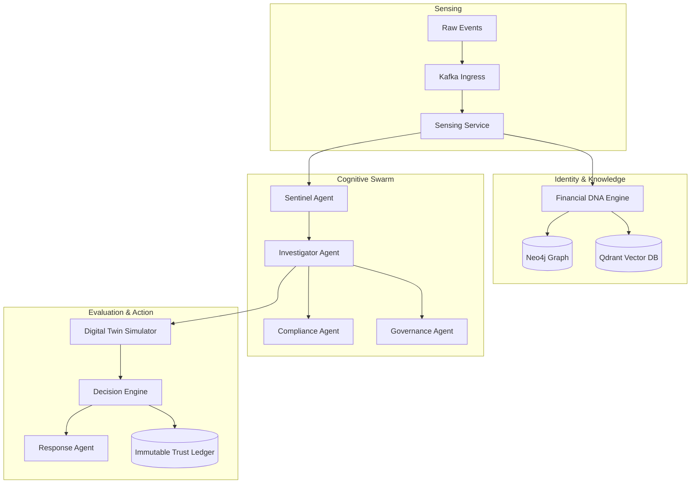

# Technical Design Document (TDD)
## AEGIS-FI — Swarm Cognitive Architecture

---

## 1. High-Level Architecture

AEGIS-FI uses a modular event-driven cognitive architecture. Raw events flow through Kafka into ingestion services, propagate to identity and knowledge layers, are processed by a multi-agent swarm, simulated by a digital twin, decided by the core engine, executed by the response agent, and audited on an immutable trust ledger.

---

## 2. Multi-Agent Swarm Details

### 2.1 Sentinel Agent (Detection)
* **Objective:** Instantly detect behavioral anomalies.
* **Technology:** Scikit-learn (Isolation Forest), XGBoost, FastAPI.
* **Input:** Transaction data, behavioral telemetry, device fingerprint.
* **Logic:** Computes risk score based on outlier metrics and short-term transaction velocity.

### 2.2 Investigator Agent (Root Cause)
* **Objective:** Construct human-readable explanations.
* **Technology:** LangGraph, Gemini LLM, Vector RAG.
* **Logic:** Fetches contextual metadata from Neo4j (relationship paths) and Qdrant (similar cases), generates evidence, and writes explainability reports.

### 2.3 Compliance Agent (Policy)
* **Objective:** Assure adherence to regulatory bounds.
* **Logic:** Validates transactions against hardcoded compliance rules (RBI transaction velocity, AML limits, country blacklist restrictions).

### 2.4 Governance Agent (Model Audit)
* **Objective:** Monitor and grade the performance of AI agents.
* **Logic:** Tracks false-positive rates, decision delays, drift metrics, and updates the agent's historical trust score.

---

## 3. Core Interaction Flow

1. **Ingest:** API Gateway receives transaction telemetry, pushes to Kafka.
2. **Profile Enrichment:** Financial DNA Engine checks/updates Customer, Device, and Agent DNA profiles.
3. **Anomaly Check:** Sentinel Agent runs inference, outputting a risk score.
4. **Root Cause Analysis:** Investigator queries similar cases from Qdrant and relationship clusters in Neo4j.
5. **Simulation:** Digital Twin simulates "approve", "verify", or "freeze" to predict loss vs. customer friction.
6. **Decision:** Decision Engine selects optimal action.
7. **Audit:** Decision logged to Trust Ledger and execution dispatched to Response Agent.
